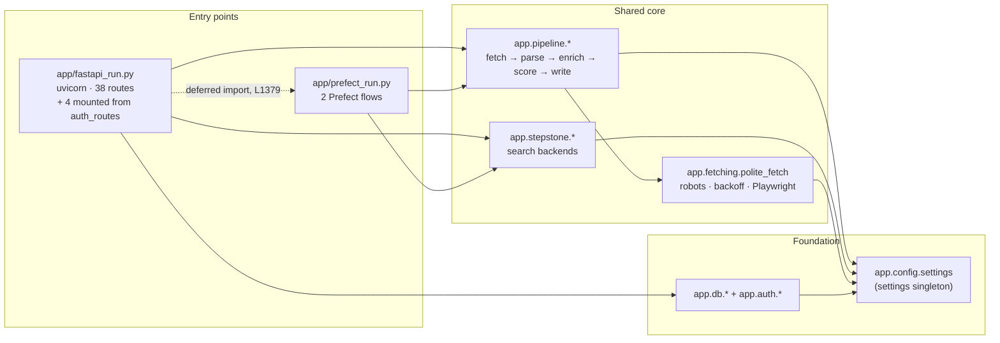

# Architecture

Structural map of the Job Agent codebase: what the modules are, how they actually depend on
each other, what they expose, and where the coupling concentrates.

Generated 2026-07-31 against branch `main` @ `660a6a0`. Analysis only — no code was modified.

> **⚠ STALE IN THREE KNOWN PLACES — checked 2026-08-07 against `fd85028`.** `660a6a0` is not
> an ancestor of `bc301e3`, so this file predates fixes that have since landed. Do not cite it
> for these without re-checking:
>
> - **`get_db` is described as dead code with one reference.** Fixed in `bc301e3`.
> - **Three missing `__init__.py` files.** Also fixed in `bc301e3`.
> - **`app/db/types.py` is absent from the module inventory.** It is new, and it matters — it
>   is what makes the ORM dialect-neutral, which is direct evidence for D1.
>
> Its `_LogSink` finding (backlog A1) **is** still accurate. Everything else was spot-checked
> and reconciled. For current reference counts, coverage and route status use
> [liveness-report.md](liveness-report.md), which was generated against `fd85028`; this file
> remains the better *structural* map (dependency graph, coupling) and the two are complements,
> not substitutes. Regenerate before CP‑4.

---

## 1. Method & caveats

| Question | How it was answered |
| --- | --- |
| Module inventory | AST walk of every non-vendored `.py` file (`ast.parse`, top-level `FunctionDef` / `ClassDef` / `Assign`) |
| Dependency graph | AST walk of `Import` / `ImportFrom` nodes, classified by **runtime** / **`TYPE_CHECKING`-guarded** / **function-local (deferred)** |
| Import cycles | Tarjan SCC over the runtime graph, then empirically confirmed by importing each suspect module in a fresh interpreter |
| Public API surface | AST for route decorators and `__all__`; **pyright `findReferences`** for which symbols are actually consumed |
| Coupling ranking | **pyright `findReferences`** per exported symbol, cross-checked against import fan-in/fan-out |

Two caveats worth stating up front:

- **Symbol-level coupling is LSP-derived; the module-level graph is AST-derived.** Building the
  full graph from `findReferences` alone would mean one call per symbol across ~110 public
  symbols. The AST import parse is exact for edges (it is a real parse, not a text match), and
  every claim about *usage* below is backed by `findReferences`.
- **Counts exclude `.venv/`, `graphify-out/`, `output/`, `.prefect/`, `__pycache__/`.**
  Third-party imports are not modelled.

---

## 2. System at a glance

Two independent entry points share one library core:



`fastapi_run.py` can drive a batch either **out-of-process** (subprocess → `prefect_run.py`) or
**in-process** (`_run_prefect_inprocess_batch`, which imports `crawl_and_save_flow` /
`process_run_flow` lazily at [app/fastapi_run.py:1379](app/fastapi_run.py#L1379)). That lazy
import is the only `fastapi_run → prefect_run` edge, which is why the two sit at the same
topological layer rather than one above the other.

**Size:** 67 first-party modules — 46 under `app/`, 16 tests, 2 scripts, 4 Alembic. ~9,900 LOC
in `app/`. 105 runtime `app→app` import edges plus 21 `tests→app`.

---

## 3. Module inventory

LOC is raw line count. "Public" = top-level names not prefixed with `_`.

### Entry points

| Module | LOC | Public surface |
| --- | --- | --- |
| [app/fastapi_run.py](app/fastapi_run.py) | 2100 | FastAPI `app`; 38 routes; 17 request/response models |
| [app/prefect_run.py](app/prefect_run.py) | 699 | `SeedConfig`, `crawl_and_save_flow()`, `process_run_flow()` |

### `app/config` — configuration & profiles

> No `__init__.py` — implicit namespace package (see §8).

| Module | LOC | Public surface |
| --- | --- | --- |
| [settings.py](app/config/settings.py) | 223 | `Settings`, `settings` (module singleton) |
| [focus.py](app/config/focus.py) | 163 | `FocusConfig`, `DEFAULT_FOCUS`, `load_focus_profiles()`, `get_focus_config()` |
| [profile_store.py](app/config/profile_store.py) | 101 | `PROFILES_PATH`, `load_profiles()`, `save_profiles()`, `get_profile_keys()`, `get_profile()`, `upsert_profile()`, `delete_profile()`, `get_default_profiles_dict()` |

### `app/pipeline` — the processing core

| Module | LOC | Public surface |
| --- | --- | --- |
| [scoring.py](app/pipeline/scoring.py) | 1084 | `score_job()`, `classify_blockers()`, `apply_blocker_caps()`, `aggregate_heuristic()`, `compute_alpha()`, 6 `apply_*` component fns, `HeuristicWeights`, `SCORING_VERSION` |
| [llm_enrich.py](app/pipeline/llm_enrich.py) | 366 | `EnrichmentMeta`, `enrich_jobposting()`, `llm_score_job()` |
| [url_pool_maintenance.py](app/pipeline/url_pool_maintenance.py) | 235 | `prune_unavailable_stepstone_urls()` |
| [pipeline.py](app/pipeline/pipeline.py) | 197 | `fetch_job_details()`, `write_job_bundle()` |
| [resume_parse.py](app/pipeline/resume_parse.py) | 187 | `extract_text_from_file()`, `parse_resume_text()`, `parse_resume_file()` |
| [output.py](app/pipeline/output.py) | 165 | `write_bundle()`, `write_summary()` |
| [state.py](app/pipeline/state.py) | 165 | `load_state()`, `save_state()`, `cache_get()`, `cache_put()`, `STATE_DIR`, `CACHE_DIR` |
| [parsers.py](app/pipeline/parsers.py) | 143 | `extract_jobposting_from_html()` |
| [models.py](app/pipeline/models.py) | 140 | `UnifiedJobPosting`, `FetchMeta`, `LLMDetail`, `JobScoring`, `JobDetailsResponse`, `BlockerCaps`, `Constraints`, `FocusProfileModel` |
| [templating.py](app/pipeline/templating.py) | 67 | `TEMPLATES_DIR`, `generate_bundle()` |
| [url_pool.py](app/pipeline/url_pool.py) | 62 | `pool_path_for_profile()`, `normalize_url()`, `load_pool_set()`, `append_pool_entries()` |
| [potential_bucket.py](app/pipeline/potential_bucket.py) | 60 | `PotentialDecision`, `decide_potential()` |
| [\_\_init\_\_.py](app/pipeline/__init__.py) | 23 | Re-exports 12 names via `__all__` |

### `app/stepstone` — site-specific search backends

| Module | LOC | Public surface |
| --- | --- | --- |
| [search_playwright.py](app/stepstone/search_playwright.py) | 377 | `search_stepstone_pw()` |
| [search_http.py](app/stepstone/search_http.py) | 316 | `search_stepstone()` |
| [dates.py](app/stepstone/dates.py) | 140 | `parse_iso8601_utc()`, `isoformat_utc()`, `parse_stepstone_listing_date()` |
| [smoke.py](app/stepstone/smoke.py) | 82 | `search_stepstone()` (backend-dispatching façade), `search_stepstone_http()`, `search_stepstone_pw()` |
| [\_\_init\_\_.py](app/stepstone/__init__.py) | 14 | Re-exports 6 names via `__all__` |

### `app/db` — persistence

| Module | LOC | Public surface |
| --- | --- | --- |
| [crud_profiles.py](app/db/crud_profiles.py) | 211 | 8 fns incl. `upsert_profile_for_user()`, `seed_default_profiles_for_user()`, `get_focus_profile_model_for_user()` |
| [models.py](app/db/models.py) | 205 | `User`, `Resume`, `Profile`, `Run`, `RunItem`, `UrlPoolEntry` |
| [session.py](app/db/session.py) | 112 | `db_session()`, `get_db()`, `run_db_with_retries()`, `is_transient_db_error()`, `ping_db()` |
| [engine.py](app/db/engine.py) | 64 | `make_engine()`, `get_engine()` |
| [crud_users.py](app/db/crud_users.py) | 26 | `get_user_by_email()`, `get_user_by_id()`, `create_user()` |
| [health.py](app/db/health.py) | 26 | `check_db()` |
| [base.py](app/db/base.py) | 6 | Declarative `Base` |

### `app/auth`, `app/api`, `app/fetching`, `app/common`, `app/gui_runs`

| Module | LOC | Public surface |
| --- | --- | --- |
| [fetching/polite_fetch.py](app/fetching/polite_fetch.py) | 525 | `fetch_job_html()`, `FetchError`, `AccessDeniedError`, `RobotsDisallowedError`, `TransientFetchError`, `RobotsEntry`, `DomainState`, 14 tuning constants |
| [api/schemas.py](app/api/schemas.py) | 194 | 22 Pydantic request/response models |
| [gui_runs/run_manager.py](app/gui_runs/run_manager.py) | 168 | `create_run_dir()`, `get_run_dir()`, `write_status()`, `load_status()`, `read_log_chunk()`, `write_latest()`, + 9 more |
| [common/utils.py](app/common/utils.py) | 113 | `slugify()`, `ensure_dir()`, `safe_filename()`, `sha256_bytes()`, `timestamp_iso()`, `atomic_write_text()`, `atomic_write_json()`, `to_jsonable()` |
| [api/auth_routes.py](app/api/auth_routes.py) | 97 | `router` (prefix `/auth`), 4 routes |
| [auth/deps.py](app/auth/deps.py) | 65 | `get_current_user()` |
| [common/logging_ctx.py](app/common/logging_ctx.py) | 53 | `get_run_ctx()`, `set_run_ctx()`, `clear_run_ctx()`, `run_ctx_scope()` |
| [auth/security.py](app/auth/security.py) | 44 | `hash_password()`, `verify_password()`, `create_access_token()`, `decode_token()` |
| [fetching/http_client.py](app/fetching/http_client.py) | 11 | `fetch()` |
| [auth/constants.py](app/auth/constants.py) | 2 | Cookie/session constants |

### Non-`app` code

| Path | LOC | Role |
| --- | --- | --- |
| [scripts/build_url_pool_from_snapshots.py](scripts/build_url_pool_from_snapshots.py) | 236 | Standalone; imports nothing from `app` |
| [scripts/filter_analysis_summary.py](scripts/filter_analysis_summary.py) | 76 | Standalone; imports nothing from `app` |
| [alembic/](alembic/) | 292 | 1 env + 3 revisions; touches only `app.db.base` / `app.db.models` |
| [tests/](tests/) | 769 | 16 modules, 21 edges into `app` |

---

## 4. Dependency graph

### 4.1 Topological layers

Computed as longest-path depth over **runtime module-level** edges only. A module can only
import from strictly lower layers.

| Layer | Modules |
| --- | --- |
| **0** — leaves, zero first-party deps | `config.settings`, `config.profile_store`, `common.utils`, `common.logging_ctx`, `auth.constants`, `db.base`, `fetching.http_client`, `pipeline.models`, `pipeline.parsers`, `pipeline.templating`, `pipeline.potential_bucket`, `pipeline.url_pool`, `pipeline.resume_parse`, `stepstone.dates` |
| **1** | `config.focus`, `api.schemas`, `auth.security`, `db.engine`, `db.models`, `fetching.polite_fetch`, `gui_runs.run_manager`, `pipeline.output`, `stepstone.search_http`, `stepstone.search_playwright`, `stepstone.smoke` |
| **2** | `db.session`, `db.crud_users`, `db.crud_profiles`, `pipeline.state`, `pipeline.llm_enrich`, `pipeline.url_pool_maintenance` |
| **3** | `auth.deps`, `db.health`, `pipeline.scoring` |
| **4** | `api.auth_routes`, `pipeline.pipeline` |
| **5** | `fastapi_run`, `prefect_run` |

The layering is clean — no module imports sideways or upward.

### 4.2 Fan-in / fan-out

Runtime module-level edges. `in(app)` = distinct `app` modules importing it; `in(test)` =
distinct test modules.

| Module | in(app) | in(test) | out | total |
| --- | ---: | ---: | ---: | ---: |
| `app.fastapi_run` | 0 | 1 | **26** | 27 |
| `app.config.settings` | **14** | 1 | 0 | 15 |
| `app.pipeline.pipeline` | 3 | 1 | **10** | 14 |
| `app.prefect_run` | 0 | 0 | 10 | 10 |
| `app.pipeline.scoring` | 2 | 5 | 3 | 10 |
| `app.api.auth_routes` | 1 | 0 | 9 | 10 |
| `app.config.focus` | 6 | 2 | 1 | 9 |
| `app.pipeline.state` | 4 | 2 | 3 | 9 |
| `app.pipeline.output` | 4 | 2 | 3 | 9 |
| `app.pipeline.models` | 5 | 1 | 0 | 6 |
| `app.common.utils` | 6 | 0 | 0 | 6 |
| `app.fetching.polite_fetch` | 4 | 1 | 1 | 6 |
| `app.auth.deps` | 2 | 0 | 4 | 6 |
| `app.stepstone.dates` | 5 | 0 | 0 | 5 |
| `app.db.session` | 4 | 0 | 1 | 5 |
| `app.db.models` | 4 | 0 | 1 | 5 |

`app.config.settings` is the pure sink of the system: **fan-out 0, fan-in 15**. `app.fastapi_run`
is the pure source: **fan-in 0 (from `app`), fan-out 26**.

### 4.3 Non-runtime edges

Six imports are deliberately deferred out of module scope:

| Location | Target | Kind |
| --- | --- | --- |
| [app/config/focus.py:12](app/config/focus.py#L12) | `pipeline.models.FocusProfileModel` | `TYPE_CHECKING` |
| [app/config/focus.py:108](app/config/focus.py#L108), [:146](app/config/focus.py#L146) | `pipeline.models.FocusProfileModel` | function-local |
| [app/fastapi_run.py:703](app/fastapi_run.py#L703) | `pipeline.models.FocusProfileModel` | function-local |
| [app/fastapi_run.py:1379](app/fastapi_run.py#L1379) | `prefect_run` flows | function-local |
| [tests/test_enrichment_run.py:35](tests/test_enrichment_run.py#L35), [:113](tests/test_enrichment_run.py#L113) | `pipeline.llm_enrich`, `pipeline.pipeline` | function-local (monkeypatch) |

The `focus.py` deferrals are load-bearing: they are what keep `config.focus` at layer 1 instead
of dragging the whole `app.pipeline` package underneath it.

---

## 5. Import cycles

**Literal runtime module-level edges: zero cycles.** The graph is a clean DAG.

Two cycles appear once you account for **package `__init__.py` side effects** — importing
`app.pipeline.output` first executes `app/pipeline/__init__.py`, which imports `.pipeline`,
which imports `.output`:

**Cycle A** — `app.pipeline` ⇄ `pipeline.pipeline` ⇄ `pipeline.output` ⇄ `pipeline.scoring`

```
app.pipeline (__init__)  ──imports──▶  .pipeline  ──▶  .output  ──▶  .potential_bucket
        ▲                                  │                              │
        └──────────────────────────────────┴──── triggers parent init ────┘
```

**Cycle B** — `app.stepstone` ⇄ `stepstone.search_http` ⇄ `stepstone.search_playwright`, via
`app/stepstone/__init__.py` re-exporting from both while each imports `.dates` under the same
parent.

**Both are benign, and this was verified rather than assumed.** Every member was imported
standalone in a fresh interpreter and all ten succeeded:

```
app.pipeline · app.pipeline.output · app.pipeline.scoring · app.pipeline.pipeline
app.pipeline.potential_bucket · app.config.focus · app.stepstone
app.stepstone.search_http · app.stepstone.search_playwright · app.stepstone.smoke
```

They resolve because every intra-package import uses the `from app.pipeline.X import name`
form, and submodule attribute access on a partially-initialised package has been legal since
Python 3.7.

**Risk:** latent, not active. The cycles are only survivable because of import *ordering* inside
the two `__init__.py` files. Adding a module-level import to `app/pipeline/__init__.py` above
line 1, or converting any `from .x import name` in the package to `from app import pipeline`,
would turn Cycle A into a hard `ImportError`. If a third cycle would ever be introduced through
`config.focus`, the `TYPE_CHECKING` guard at [app/config/focus.py:12](app/config/focus.py#L12)
is what currently prevents it.

---

## 6. Public API surface

### 6.1 HTTP — 42 routes

`app/api/auth_routes.py` mounts under prefix `/auth` via `app.include_router(auth_router)`.

**Auth** (`app/api/auth_routes.py`)

| Method | Path | Handler | Response |
| --- | --- | --- | --- |
| POST | `/auth/signup` | `signup` | `SignupResponse` |
| POST | `/auth/login` | `login` | `LoginResponse` |
| GET | `/auth/me` | `me` | `MeResponse` |
| POST | `/auth/logout` | `logout` | — |

**Health & diagnostics**

| Method | Path | Handler |
| --- | --- | --- |
| GET | `/health` | `health` → `Health` |
| GET | `/health/db` | `health_db` |
| GET | `/health/config` | `health_config` |
| GET | `/playwright_check` | `playwright_check` |

**Stateless job operations**

| Method | Path | Handler | Response |
| --- | --- | --- | --- |
| GET | `/search_stepstone` | `search_stepstone` | — |
| POST | `/search_stepstone_list` | `search_stepstone_list` | `SearchStepstoneListResponse` |
| POST | `/job_details` | `job_details` | `JobDetailsResponse` |
| POST | `/bundle` | `bundle` | `BundleResponse` |
| POST | `/aggregate_report` | `aggregate_report` | `AggregateReportResponse` |

**Profiles** — note the dual surface: `/api/my/profile/*` is user-scoped and DB-backed, while
`/api/profile/*` is the global file-backed store (`profile_store`).

| Method | Path | Handler | Response |
| --- | --- | --- | --- |
| GET | `/api/profiles` | `list_profiles` | `dict` |
| GET | `/api/my/profiles` | `list_my_profiles` | `dict` |
| GET | `/api/my/me` | `get_my_me` | `MeResponse` |
| GET | `/api/my/profile/{key}` | `get_my_profile` | `FocusProfileModel` |
| POST | `/api/my/profile` | `upsert_my_profile` | `FocusProfileModel` |
| POST | `/api/my/profile/{key}` | `upsert_my_profile_by_key` | `FocusProfileModel` |
| DELETE | `/api/my/profile/{key}` | `delete_my_profile` | `dict` |
| GET | `/api/my/profile/{profile_key}/latest` | `get_my_profile_latest` | `dict` |
| POST | `/api/my/profile/{profile_key}/url_pool/prune_stepstone` | `prune_profile_url_pool_stepstone` | `MaintenanceRunResponse` |
| GET | `/api/profile/{key}` | `get_profile_api` | `FocusProfileModel` |
| POST | `/api/profile/{key}` | `upsert_profile_api` | `FocusProfileModel` |
| DELETE | `/api/profile/{key}` | `delete_profile_api` | `dict` |

**Résumés**

| Method | Path | Handler | Response |
| --- | --- | --- | --- |
| POST | `/api/my/resume` | `upload_resume` | `ResumeUploadResponse` |
| GET | `/api/my/resumes` | `list_resumes` | `List[ResumeListItem]` |
| GET | `/api/my/resume/{resume_id}` | `get_resume_detail` | `ResumeDetailResponse` |
| POST | `/api/my/resume/{resume_id}/activate` | `activate_resume` | `dict` |

**Runs & artifacts**

| Method | Path | Handler | Response |
| --- | --- | --- | --- |
| POST | `/api/run_single` | `run_single` | `RunSingleResponse` |
| POST | `/api/start_batch_run` | `start_batch_run` | `BatchRunStatus` |
| GET | `/api/run_status/{run_id}` | `get_run_status` | `BatchRunStatus` |
| GET | `/api/run_logs/{run_id}` | `get_run_logs` | `RunLogsResponse` |
| GET | `/api/run_summary/{run_id}` | `get_run_summary` | `RunSummaryResponse` |
| GET | `/api/run_artifacts/{run_id}/potential_applications` | `list_potential_applications` | `PotentialApplicationsResponse` |
| GET | `/api/run_artifacts/{run_id}/potential_applications/{job_key}` | `get_potential_application_detail` | `PotentialApplicationDetailResponse` |
| GET | `/run_state` · POST `/run_state` | `get_run_state` / `set_run_state` | `RunState` |

**Server-rendered GUI**

| Method | Path | Handler |
| --- | --- | --- |
| GET | `/gui/login` · `/gui/profiles` · `/gui/run` · `/gui/logout` | `gui_*` |

### 6.2 Declared Python API (`__all__`)

Only two packages declare one:

- **`app.pipeline`** — `fetch_job_details`, `write_job_bundle`, `generate_bundle`,
  `write_bundle`, `write_summary`, `UnifiedJobPosting`, `score_job`, `enrich_jobposting`,
  `cache_get`, `cache_put`, `load_state`, `save_state`
- **`app.stepstone`** — `search_stepstone`, `search_stepstone_http`,
  `search_stepstone_playwright`, `isoformat_utc`, `parse_stepstone_listing_date`,
  `parse_iso8601_utc`

`app.fetching/__init__.py` re-exports without an `__all__`. All other packages are empty or
docstring-only.

Worth noting: **no internal caller uses either `__all__`.** `findReferences` on
`pipeline.fetch_job_details` shows consumers importing `app.pipeline.pipeline` directly, not the
package. The `__init__` re-exports are a façade for external consumers only — and, incidentally,
the cause of Cycle A.

### 6.3 Actually-consumed symbols (pyright `findReferences`)

Ranked by total references, with the count of distinct files:

| Symbol | Defined in | Refs | Files |
| --- | --- | ---: | ---: |
| `settings` | `config/settings.py:202` | **104** | **16** |
| `get_current_user` | `auth/deps.py:17` | 48 | 3 |
| `DEFAULT_FOCUS` | `config/focus.py:104` | 27 | 8 |
| `FocusProfileModel` | `pipeline/models.py:112` | 25 | 4 |
| `score_job` | `pipeline/scoring.py:853` | 20 | 8 |
| `db_session` | `db/session.py:103` | 19 | 3 |
| `FocusConfig` | `config/focus.py:16` | 18 | 4 |
| `UnifiedJobPosting` | `pipeline/models.py:8` | 11 | 6 |
| `write_bundle` | `pipeline/output.py:32` | 11 | 6 |
| `fetch_job_details` | `pipeline/pipeline.py:41` | 9 | 6 |
| `generate_bundle` | `pipeline/templating.py:34` | 9 | 5 |
| `cache_get` | `pipeline/state.py:99` | 7 | 5 |
| `fetch_job_html` | `fetching/polite_fetch.py:432` | 7 | 4 |
| `get_focus_config` | `config/focus.py:154` | 7 | 3 |
| `run_db_with_retries` | `db/session.py:49` | 6 | 3 |
| `create_run_dir` | `gui_runs/run_manager.py:51` | 5 | 3 |
| `write_job_bundle` | `pipeline/pipeline.py:172` | 5 | 3 |
| `extract_jobposting_from_html` | `pipeline/parsers.py:83` | 5 | 3 |
| `atomic_write_json` | `common/utils.py:67` | 5 | 2 |
| `crawl_and_save_flow` | `prefect_run.py:301` | 4 | 2 |
| `llm_score_job` | `pipeline/llm_enrich.py:210` | 3 | 2 |
| `Settings` (class) | `config/settings.py:49` | 3 | 1 |
| `get_db` | `db/session.py:81` | **1** | **1** |

---

## 7. The three most coupled modules

Ranked by total distinct-module coupling (fan-in + fan-out), corroborated by symbol-level
reference counts.

### 1. `app/config/settings.py` — the universal sink

**14 of 46 `app` modules import it; 104 references across 16 files; imports nothing.**

Every layer depends on it. `polite_fetch.py` alone reads 14 settings fields at module scope
([lines 16–35](app/fetching/polite_fetch.py#L16)), meaning its tuning constants are frozen at
import time. `state.py` derives `STATE_DIR` and `CACHE_DIR` from it at
[lines 16–19](app/pipeline/state.py#L16).

This is the *good* kind of coupling — a leaf with fan-out 0 that cannot participate in a cycle
and cannot propagate change downward. The cost is that the module-level reads make settings
effectively immutable after import, which is why tests reach for `_TemporaryEnv`
([app/fastapi_run.py:338](app/fastapi_run.py#L338)) and subprocess isolation rather than
rebinding config.

### 2. `app/fastapi_run.py` — the god-object entry point

**Imports 26 of 46 `app` modules — more than half the codebase. 2,100 LOC, 38 routes, 17
inline Pydantic models, 62 top-level functions.**

Nothing in `app` imports it (fan-in 0), so it is a pure sink for change: any structural edit
anywhere in `app` can force an edit here. It reaches across every package boundary — DB,
auth, pipeline, stepstone, fetching, gui_runs, prefect. It also carries responsibilities that
are not routing:

- 17 request/response models declared inline (`BatchRunStatus`, `RunLogsResponse`,
  `PotentialApplicationsResponse`, …) while a dedicated [app/api/schemas.py](app/api/schemas.py)
  already holds 22 others
- two full batch-orchestration implementations, `_run_prefect_batch`
  ([L1185](app/fastapi_run.py#L1185), subprocess) and `_run_prefect_inprocess_batch`
  ([L1367](app/fastapi_run.py#L1367)), ~330 LOC of near-duplicate logic
- a third orchestrator, `_run_prune_url_pool` ([L1538](app/fastapi_run.py#L1538))
- filesystem artifact readers (`_read_json_file`, `_pick_first_json`, `_extract_best_effort_fields`)

`get_current_user` appears 44 times in this one file — the auth dependency is threaded through
nearly every handler by hand.

### 3. `app/pipeline/pipeline.py` — the narrow-waist orchestrator

**Fan-out 10 (highest in the library core), fan-in 4, but only 197 LOC and 2 public functions.**

It is the single point where fetching, parsing, enrichment, scoring, state, and output are
composed: it imports `polite_fetch`, `parsers`, `llm_enrich`, `scoring`, `state`, `output`,
`templating`, `models`, `focus`, and `settings`. Both entry points depend on it, and it is a
member of Cycle A.

Unlike `fastapi_run.py`, this is coupling by design — a deliberate narrow waist with a high
fan-out but a tiny surface (`fetch_job_details`, `write_job_bundle`). The concern is not its
size but that it sits inside the `app.pipeline` package whose `__init__.py` re-exports it,
which is what closes the cycle.

**Runners-up:** `app/prefect_run.py` (fan-out 10, 699 LOC, but fan-in 0),
`app/pipeline/scoring.py` (1,084 LOC — the largest library module; 5 of 16 test modules import
it, making it the best-covered core), and `app/api/auth_routes.py` (fan-out 9 in only 97 LOC —
dense but appropriate for a router).

---

## 8. Structural observations

Found while mapping; each is verified, none were acted on.

**`get_db` is dead code.** `findReferences` on
[app/db/session.py:81](app/db/session.py#L81) returns exactly one result — its own definition.
The FastAPI-dependency-style generator `get_db(max_retries=2, base_sleep=0.4) ->
Generator[Session, None, None]` has zero call sites; every handler uses the `db_session()`
context manager instead (19 references). Nothing imports it, so it is not even reachable via
`Depends`.

**Three packages are missing `__init__.py`:** `app/config/`, `app/gui_runs/`, and `tests/`.
They work as PEP 420 implicit namespace packages, but they are the only three under `app/`
without one — and `app/config` is the most-imported package in the codebase. This is
inconsistent rather than broken.

**Two parallel profile stores.** `app.config.profile_store` (file-backed, global,
`PROFILES_PATH`) and `app.db.crud_profiles` (DB-backed, user-scoped) both exist and are both
routed. `crud_profiles` imports `profile_store` for defaults
([seed_default_profiles_for_user](app/db/crud_profiles.py)), so they are not independent. Worth
confirming this is intentional layering and not a half-finished migration.

**The URL-pool prune path is broken by an indentation bug.** In `_run_prune_url_pool`, the
`try/except/finally` at [app/fastapi_run.py:1584-1617](app/fastapi_run.py#L1584) is indented
*inside* the `class _LogSink` body ([L1567](app/fastapi_run.py#L1567)) rather than in the
enclosing function. Three consequences:

1. The `try` block executes during **class-body evaluation**, not after it.
2. `_LogSink(log)` at [L1586](app/fastapi_run.py#L1586) fails, because the name is not bound
   until the class body finishes.
3. The bare `except Exception` at [L1612](app/fastapi_run.py#L1612) swallows it and records
   `status["error"]`, so the run reports `"failed"` instead of raising.

Verified with a standalone repro of the same structure:

```
{'status': 'failed',
 'error': "Prune failed: cannot access free variable '_LogSink'
           where it is not associated with a value in enclosing scope"}
```

So `POST /api/my/profile/{profile_key}/url_pool/prune_stepstone` always reports a failed run,
`prune_unavailable_stepstone_urls` is never actually called, and the failure is silent. The
`app.fastapi_run → app.pipeline.url_pool_maintenance` edge in §4 is a real import but a dead
call path. Fixing it is a de-indent of lines 1584–1617; left unchanged here.

**Other pre-existing pyright errors** in modules touched during this analysis. Not introduced by
it, not fixed:

| File | Line | Issue |
| --- | --- | --- |
| `app/fastapi_run.py` | 495, 1676 | `FetchMeta \| None` passed where `FetchMeta` required |
| `app/config/settings.py` | 24 | `None` assigned to declared `Dict[str, float]` |
| `app/prefect_run.py` | 560–564 | three `list`/`str`/`None` assigned to an `int`-typed dict slot |
| `app/pipeline/llm_enrich.py` | 109 | `model_dump` accessed on `FocusConfig` (a dataclass, not a Pydantic model) |
| `app/pipeline/parsers.py` | 106 | `.get_text` on a possibly-`None` value |
| `app/pipeline/state.py` | 62 | `asdict` given `DataclassInstance \| type[DataclassInstance]` |
| `app/fetching/polite_fetch.py` | 340 | `str` passed to Playwright's `Literal`-typed `wait_until` |
