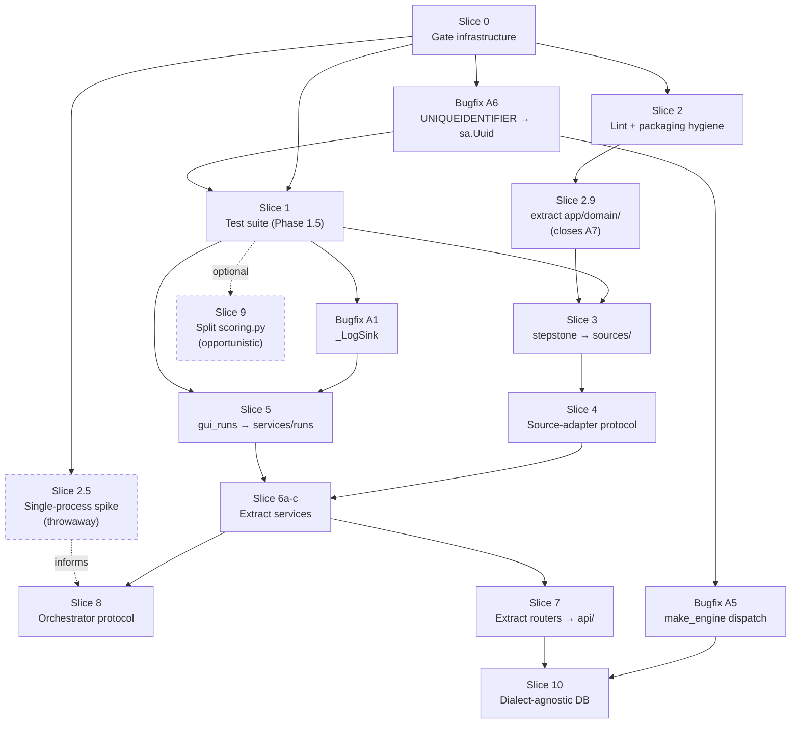

# Refactor Plan

Execution plan for the restructure described in [AGENTS.md](../AGENTS.md),
derived from the dependency data in [architecture.md](architecture.md).

Written 2026-07-31 against `main` @ `660a6a0`. **No code written yet** — this is Phase 2 of
[claude-refactor-playbook.md](claude-refactor-playbook.md).

Every number and every command below was measured or executed against the repo while writing
this. Nothing is aspirational.

---

## 1. Measured baseline

Record these. Every "did the refactor break it?" question resolves against them.

| Gate | Command | Result @ `660a6a0` |
| --- | --- | --- |
| Tests | `.venv/bin/python -m pytest -q` | **18 passed, 6 failed** |
| Types | `pyright app tests scripts --outputjson --pythonpath .venv/bin/python \| jq '.summary'` | **32 errors, 0 warnings**, 63 files |
| Lint | `.venv/bin/ruff check .` | **747 findings** (672 auto-fixable) |
| Coverage | `.venv/bin/python -m pytest --cov=app --cov-report=term-missing -q` | **39% total** |

Pre-existing failures (do not "fix" these during a slice — they are Slice 1's input):

```
tests/test_api_endpoints.py::test_profile_crud                       assert 401 == 200
tests/test_api_endpoints.py::test_run_single_with_stubbed_pipeline
tests/test_api_endpoints.py::test_run_logs_endpoint                  TypeError: create_run_dir()
tests/test_enrichment_run.py::test_enrich_jobposting_uses_openai_model_env_and_merges_fields
tests/test_enrichment_run.py::test_fetch_job_details_calls_enrichment_when_enrich_true
tests/test_scoring.py::test_experience_penalty_triggers              assert -1 <= -15
```

Coverage on the modules the structural slices actually touch:

| Module | Coverage | Slice that moves it |
| --- | ---: | --- |
| `app/prefect_run.py` | **0%** | 8 |
| `app/pipeline/url_pool_maintenance.py` | 14% | 6c |
| `app/gui_runs/run_manager.py` | **23%** | 5 |
| `app/fastapi_run.py` | **24%** | 6, 7 |
| `app/stepstone/search_playwright.py` | 9% | 3 |
| `app/stepstone/search_http.py` | 12% | 3 |
| `app/pipeline/pipeline.py` | 62% | 9 |
| `app/pipeline/scoring.py` | 87% | 9 |

Pyright's 32 errors by file — 17 are in `tests/`, and Slice 1 replaces that suite wholesale:

```
12  tests/test_enrichment_run.py          3  app/prefect_run.py
 3  tests/test_pipeline_end_to_end.py     3  app/fastapi_run.py
 2  tests/test_api_endpoints.py           2  app/pipeline/llm_enrich.py
                                          1  each: scripts/build_url_pool_from_snapshots.py,
                                                   app/{stepstone/search_playwright,pipeline/state,
                                                   pipeline/scoring,pipeline/parsers,
                                                   fetching/polite_fetch,db/engine}.py
```

### 1.1 Baseline provenance (R1)

A gate compared against a baseline measured under different config is not a gate. What was
present at measurement time:

| Config file | State @ `660a6a0` | Effect on the numbers |
| --- | --- | --- |
| `pyrightconfig.json` | **Absent** — verified, not assumed | pyright runs in its default mode over explicitly-listed paths |
| `pyproject.toml` `[tool.ruff]` | Present | `select = ["E","F","I","UP","B"]`, `exclude` set |
| `pyproject.toml` `[tool.ruff.lint.per-file-ignores]` | **Added after `660a6a0`** | `B008` suppressed → 747, not the 769 measured at the commit |
| `pyproject.toml` `[tool.pytest.ini_options]` | **Added after `660a6a0`** | No effect on counts — verified, still 18/6 |

**The 63-vs-67 file count is a scoping difference, not a discrepancy.** Measured three ways:

| Invocation | Files | Errors |
| --- | ---: | ---: |
| `pyright app tests scripts` | 63 | **32** |
| `pyright app tests scripts alembic` | 67 | **32** |
| `pyright .` | 68 | **32** |

63 = `app` (46) + `tests` (15) + `scripts` (2); 67 adds `alembic/` (4). **The error count is 32
under every scoping**, so the baseline is robust to this choice and no reconciliation of the
*number that gates* is needed. The recorded 63 corresponds to the scoping in §2, which is also
what PHASE-0-RUNBOOK §0.3's proposed `include` produces.

**`pyrightconfig.json` genuinely does not exist** — `ls` confirms it. R1 suspected Slice 0 listed
existing work; it does not. Slice 0 keeps that item. Once it lands with
`typeCheckingMode: "basic"`, the error count *will* move — re-measure and update both this table
and `ci/baseline.json` in the same commit.

---

## 2. Gate

A slice is done when all three hold. Run from the repo root with the venv active.

```bash
.venv/bin/python -m pytest -q                                          # 0 failed, 0 skipped
pyright app tests scripts --outputjson --pythonpath .venv/bin/python \
  | jq '.summary'                                                      # errors <= baseline
.venv/bin/ruff check .                                                 # findings <= baseline
```

Per [AGENTS.md](../AGENTS.md), type-clean is necessary but not sufficient.
Anything touching the run lifecycle also requires inspecting the artifacts a real run produces.

Each slice below adds a **slice-specific** verification command on top of these three. That
extra command is the one that proves *this particular move* worked, as opposed to proving
nothing broke.

---

## 3. Slice order

Leaves first. Solid arrows are hard dependencies.



**Slices 1 and 2 are not optional preludes.** `fastapi_run.py` sits at 24% coverage and
`run_manager.py` — which owns the artifact contract that "must never break" — at 23%. Without an
oracle this is not a refactor; it is a rewrite and a hope.

[PHASE-0-RUNBOOK.md](PHASE-0-RUNBOOK.md) §0.5 phrases that bar as "~60% coverage". **Slice 1 does
not use that gate** — see R3 under Slice 1 for why a percentage on `fastapi_run.py` actively
rewards tests bound to internals. The checklist replaces it; the *principle* it encodes stands.

Dashed nodes are optional or throwaway: **Slice 2.5** is a spike whose output is a paragraph, and
**Slice 9** is opportunistic (R9).

---

## Slice 0 — Gate infrastructure  ✅ LANDED

No application code. Makes the other slices measurable.

**Files touched:** `pyrightconfig.json` (new), `.importlinter` (new), `ci/gate.py`,
`ci/baseline.json`, `pyproject.toml`, `requirements.lock.txt`, `.github/workflows/ci.yml`.

**Symbols moved:** none. **Shim strategy:** N/A.

`.github/workflows/gate.yml` was **not** created — `ci.yml` already runs the ratchet and a second
workflow would just be a duplicate gate to keep in sync.

### Outcome — three things the brief predicted that did not happen

**1. The pyright baseline did not move.** The brief expected `typeCheckingMode: "basic"` to change
the 32-error count. It did not. Verified deliberately rather than assumed, by sweeping the mode
over the same 63 files:

| `typeCheckingMode` | Errors |
| --- | ---: |
| `off` | 0 |
| `basic` | **32** |
| `standard` | **32** |
| `strict` | 1036 |

The config *is* being read — `off` and `strict` prove that. `basic` and `standard` simply coincide
on this codebase, so pyright's CLI default was already equivalent. `ci/baseline.json` keeps 32,
and the 1036 is a concrete illustration of why PHASE-0-RUNBOOK §0.3 says start at `basic` and
ratchet up.

**2. The strict-markers verify command was wrong.** The original was:

```bash
.venv/bin/python -m pytest -q -m nosuchmarker 2>&1 | grep -q "ERROR"   # never fires
```

`--strict-markers` validates markers *applied to tests* via `@pytest.mark.x`. A `-m` **expression**
naming an unknown marker just deselects everything and exits 0, so that command could never have
detected a broken config. Replaced below with one that applies an unregistered marker to a real
test — confirmed to error on an unregistered mark and pass on `external`.

**3. `.importlinter` cannot reference unbuilt packages at all.** Not "fails until the slice lands"
— import-linter **aborts the entire run** on an unresolvable module and emits no summary line, so
the ratchet would have measured nothing. Handled two ways: optional layers are parenthesised
(`(app.services)`), and `forbidden` contracts naming future packages are commented out with the
slice that enables them. Details in the file's header.

`app.config` is parenthesised for a *different* reason — it exists as a directory but has no
`__init__.py`, so grimp cannot see it. Backlog B2 (Slice 2) fixes that; until then config's
position in the layering is not enforced.

### Import contracts — seeded at 2, not 0

`.importlinter` per [AGENT-WORKFLOW.md](AGENT-WORKFLOW.md) §7, wired into `ci/gate.py` as a fourth
measurer. Current state: **4 kept, 2 broken**, and `importlinter_broken: 2` is the seeded ratchet.

Both broken contracts come from **one** illegal edge:

```
app.db.crud_profiles -> app.pipeline.models   (crud_profiles.py:12)
```

`db/` importing `pipeline/` is forbidden by the target architecture. It trips both the `layers`
contract and the targeted `db-below-pipeline` contract, which is why one violation scores 2.
Logged as backlog **A7**.

### Verify

```bash
# config is picked up (filesAnalyzed must be ~63, not thousands)
pyright --outputjson | jq '{files: .summary.filesAnalyzed, errors: .summary.errorCount}'

# strict-markers rejects an unregistered marker APPLIED TO A TEST.
# (`-m nosuchmarker` does NOT test this -- it just deselects and exits 0.)
mkdir -p /tmp/markprobe && printf 'import pytest\n\n@pytest.mark.definitely_not_registered\ndef test_p(): pass\n' > /tmp/markprobe/test_p.py
.venv/bin/python -m pytest -c pyproject.toml /tmp/markprobe -q 2>&1 | grep -q "not found in \`markers\`" \
  && echo "strict-markers active"
printf 'import pytest\n\n@pytest.mark.external\ndef test_p(): pass\n' > /tmp/markprobe/test_p.py
.venv/bin/python -m pytest -c pyproject.toml /tmp/markprobe -q 2>&1 | tail -1   # 1 passed
rm -rf /tmp/markprobe

# import contracts parse and report a count (not an abort)
.venv/bin/lint-imports 2>&1 | grep -E "Contracts: [0-9]+ kept, [0-9]+ broken"

# the ratchet covers all four gates
.venv/bin/python ci/gate.py

# R2: record BOTH dialect properties, so the distinction is not rediscovered later.
# Property 1 -- models are DDL-portable. FAILS today (backlog A6): 12 UNIQUEIDENTIFIER columns.
.venv/bin/python -c "
from sqlalchemy import create_engine
from app.db.base import Base
import app.db.models  # noqa: F401  -- registers the tables
try:
    Base.metadata.create_all(create_engine('sqlite://'))
    print('models are DDL-portable -- A6 is fixed, unblock the DB contract tests')
except Exception as e:
    print('models NOT portable (expected until A6) ->', type(e).__name__, str(e)[:70])"

# Property 2 -- the app can build an engine for the dialect. Fails on :memory: (backlog A5).
.venv/bin/python -c "
from app.db.engine import make_engine
make_engine('sqlite:///./_probe.db'); print('file-based SQLite: engine OK')
try:
    make_engine('sqlite://'); print('in-memory: engine OK -- A5 is fixed, update TEST-STRATEGY 5.5')
except TypeError as e:
    print('in-memory: still broken (expected until A5) ->', str(e)[:60])"
rm -f _probe.db
```

**Rollback:** delete the three files.

---

## Slice 1 — Characterization test suite  ⟵ blocking gate

Implements [TEST-STRATEGY.md](TEST-STRATEGY.md) in full. **No `app/` code
changes.** This is the oracle every later slice is graded against.

**Files touched:** `tests/` — new `tests/unit/`, `tests/contracts/`, `tests/integration/`,
`tests/fixtures/`; existing 16 test modules move to `tests/legacy/` and drop out of the gate.
`tests/conftest.py` grows the fixture factories.

**Symbols moved:** none in `app/`. Test helpers only.

**Shim strategy:** N/A — but note `tests/legacy/` *is* the shim here. Per
[AGENTS.md](../AGENTS.md), do not delete a legacy file until the new suite
covers its ground.

**Priority order within the slice** (highest-value first, matching the coverage gaps above):

1. `tests/contracts/test_log_streaming.py` — the offset protocol. Deterministic, trivial, and
   `run_manager.py` is at 23%.
2. `tests/contracts/test_run_artifacts.py` — `status.json` / `run.log` / `run_metrics.json`
   shape, including the absent-optional-artifact case.
3. `tests/contracts/test_*_api.py` — every route authenticated + unauthenticated. **These must
   pass unchanged after Slice 7.** That is the acceptance criterion for the router split.
4. `tests/unit/test_scoring_invariants.py` — relational assertions only.

**Not blocked on SQLite (R2).** An earlier draft called this blocked. It is not. The DB fixture
uses **file-based SQLite on `tmp_path`**, one fresh file per test, which works today with no
application change.

Only `:memory:` is broken: `make_engine` passes `pool_size`/`max_overflow`/`pool_timeout`
unconditionally, and `sqlite://` gets a `SingletonThreadPool` that rejects all three, so
collection dies with `TypeError` before any test runs (backlog A5). A file URL gets a `QueuePool`
and accepts them.

Two properties are separate and both must be checked. **R2 asserted the first one passes. It does
not** — verified while applying this amendment:

| Property | Check | Status |
| --- | --- | --- |
| The app can build an engine for the dialect | `make_engine("sqlite:///...")` | **Fails on `:memory:`** (A5), passes on a file |
| Models are DDL-portable | `Base.metadata.create_all(create_engine("sqlite://"))` | **Fails — `CompileError`** (A6) |

```
sqlalchemy.exc.CompileError: (in table 'users', column 'id'):
  Compiler SQLiteTypeCompiler can't render element of type UNIQUEIDENTIFIER
```

**12 columns across all 6 tables** (`users`, `resumes`, `profiles`, `runs`, `run_items`,
`url_pool`) are typed `UNIQUEIDENTIFIER`, which is mssql-only. Neither SQLite *nor* PostgreSQL can
render it, so this also blocks the Slice 10 Postgres matrix — it is not a SQLite-specific problem.
Logged as backlog **A6**.

**What this changes for Slice 1.** The slice is still not blocked, but the reason is narrower than
R2 claimed. Split by what each test needs:

| Slice 1 work | Needs the DB? | Status |
| --- | --- | --- |
| Log streaming, run artifacts, scoring invariants — the priority-ordered items above | No | **Unblocked.** These are the highest-value tests and none of them touch the ORM |
| Contract tests for auth / profiles / resumes endpoints | Yes | **Blocked on A6** until the column type is portable |

So: start Slice 1 on the artifact and scoring work immediately, and land A6 before the
DB-touching contract tests. Do not restructure the slice around the blocker — reorder within it.

**The A6 fix is a drop-in.** SQLAlchemy 2.0's dialect-agnostic `sa.Uuid` renders
`UNIQUEIDENTIFIER` on mssql — byte-identical to today's SQL Server schema, so no migration is
needed for the existing deployment — while emitting `UUID` on PostgreSQL and `CHAR(32)` on SQLite.
Verified against SQLAlchemy 2.0.44:

```
sqlite       id CHAR(32) NOT NULL
postgresql   id UUID NOT NULL
mssql        id UNIQUEIDENTIFIER NOT NULL
```

Switching the fixture to in-memory later needs *both* `poolclass=StaticPool` and
`connect_args={"check_same_thread": False}` — without `StaticPool` every connection gets a new
empty database and the schema vanishes between calls. See TEST-STRATEGY §5.5.

**Blocked on an open question.** TEST-STRATEGY §8: `_experience_delta` returns `-1` where the
old test expected `≤ -15`. Resolve before pinning scoring behavior, or a defect gets encoded as
the specification. Answer it with `git log -p -- app/pipeline/scoring.py` over the experience
logic; if it is a live bug, pin current behavior, file it, and fix in a commit outside this plan.

**Verify:**

```bash
.venv/bin/python -m pytest -q                      # 0 failed, 0 skipped
.venv/bin/python -m pytest tests/legacy -q         # runnable on demand, not in the gate

# coverage floors on the four modules that matter, per TEST-STRATEGY §9
.venv/bin/python -m pytest --cov=app --cov-report=term-missing -q 2>&1 \
  | grep -E "fastapi_run|scoring|pipeline/pipeline|run_manager"
```

**Exit criterion (R3) — a contract checklist, not a coverage percentage.**

The earlier "both ≥ 60%" gate was wrong and is deleted. `fastapi_run.py` is 1,106 statements at
24%; reaching 60% means covering ~400 more statements in a module Slices 6–7 dismember. The 38
route contracts alone cannot get there — you would have to test `_build_seeds_from_focus`,
`_TemporaryEnv`, `_compute_cutoff_iso`, `_run_prune_url_pool`, which are precisely the symbols
Slice 6 moves. **The percentage rewards tests bound to internals** — the F1 failure mode
TEST-STRATEGY exists to prevent, reintroduced as a number.

Slice 1 exits when all of these hold:

- [ ] All 38 user-defined routes have a contract test, authenticated **and** unauthenticated
      (401), asserting status code and response shape
- [ ] Run artifacts asserted: `status.json`, `run.log`, `run_metrics.json`,
      `analysis_summary.json`, `REPORT_SUMMARY.md`
- [ ] Absent-optional-artifact case pinned — status polling must not 500 when an optional
      artifact is missing
- [ ] Run directory layout asserted as `output/<user_id>/<profile_key>/<run_id>/`
- [ ] Log streaming: offset 0, mid-file, at EOF, past EOF, append-between-reads
- [ ] All eight scoring invariants from TEST-STRATEGY §5.1, relational assertions only. No
      absolute constants except the accept/reject threshold
- [ ] No scoring test relies on `DEFAULT_FOCUS` implicitly — every one builds an explicit profile
- [ ] `DEFAULT_FOCUS` has one dedicated test asserting its shape
- [ ] Contract tests green against file-based SQLite (see R2), with A6 landed
- [ ] `pytest -q` → 0 failed, **0 skipped**, `--strict-markers` on
- [ ] `_experience_delta` question resolved and recorded (TEST-STRATEGY §8)

**Report coverage as a metric. Do not gate on it.** Do not start Slice 3 before the checklist
holds.

---

## Slice 2 — Lint and packaging hygiene

Mechanical. Sonnet 5 @ `medium` per the playbook's Phase 4b. **Ship it before the structural
slices**, not after: 672 auto-fixable findings would otherwise land inside a structural diff and
make it unreviewable.

**Files touched:** effectively all of `app/`, `tests/`, `scripts/` — plus three new
`__init__.py`.

**Symbols moved:** none. `Dict`→`dict` (317 UP006), `Optional[X]`→`X | None` (257 UP045),
import sorting (28 I001), 15 unused imports (F401).

Also in scope, because they are packaging facts rather than style:

- Add `app/config/__init__.py` and `app/gui_runs/__init__.py`. Per architecture.md §8 these are
  the only two packages under `app/` without one, and `app/config` is the most-imported package
  in the repo. The "public API boundary is what `__init__.py` re-exports" rule cannot be applied
  to a namespace package.
- Add `tests/__init__.py` only if Slice 1's layout requires it.
- Delete `get_db` from `app/db/session.py`. Confirmed dead: pyright `findReferences` returns
  exactly one result, its own definition (architecture.md §8).

**Deliberately excluded:** `B008` (22) is FastAPI's `Depends()` idiom — **already handled**; the
per-file ignores landed with the CI work in `pyproject.toml`, which is why the recorded lint
baseline is 747 rather than the 769 measured at `660a6a0`. `B904` (17, raise-without-`from`) is a
real finding but touches error-handling semantics; defer to its own commit.

**Shim strategy:** none needed — no import paths change.

**Verify:**

```bash
.venv/bin/ruff check . && .venv/bin/ruff format --check .
.venv/bin/python -m pytest -q                      # unchanged from Slice 1

# packages are real, not namespace packages
.venv/bin/python -c "
import app.config, app.gui_runs
assert app.config.__file__ and app.gui_runs.__file__, 'still a namespace package'
print('config/gui_runs are regular packages')"

# get_db is gone and nothing imported it
.venv/bin/python -c "
import app.db.session as s
assert not hasattr(s,'get_db'), 'get_db still present'
print('get_db removed')"
```

**Then:** append the commit SHA to `.git-blame-ignore-revs`, following the precedent set by
`cee14d1` (`chore: apply ruff format`). The file and `blame.ignoreRevsFile` config already exist.

---

## Standalone bugfix commits (not slices)

Three defects ship as their own commits rather than inside a slice. TEST-STRATEGY §4: characterize
first, fix second — a behavior change must not hide inside a structural diff.

| ID | Defect | Ships | Blocks |
| --- | --- | --- | --- |
| A6 | `UNIQUEIDENTIFIER` on 12 columns — models not DDL-portable | **Before Slice 1's DB tests** | DB-touching contract tests; Slice 10's Postgres matrix |
| A5 | `make_engine` rejects `:memory:` SQLite | Any time after A6 | In-memory test fixtures (a convenience, not a blocker) |
| A1 | `_LogSink` — prune endpoint always fails | Between Slice 1 and Slice 5 | Nothing; it is simply broken |

**A5 and A6 are not Slice 10 items (R2).** An engine factory that cannot construct an engine for
the project's chosen default dialect, and an ORM that cannot emit DDL for it, are defects — not
migration tasks. Slice 10 is about *changing the default and the migrations*; these two are about
the code being wrong today under a configuration the project already ships in its Dockerfile.

### A6 — `UNIQUEIDENTIFIER` → `sa.Uuid`  ✅ LANDED

**Files touched:** `app/db/models.py` (12 columns), `alembic/versions/a932afee4b12_init_schema.py`
(10), `alembic/versions/3b4d3b5b3c1a_add_resumes_table.py` (2), and a new
`tests/unit/test_db_portability.py`. No new Alembic revision.

Editing the two migrations is licensed by the **recorded exception in
[AGENTS.md](../AGENTS.md)**, and rests on one verifiable claim: `sa.Uuid` emits
`UNIQUEIDENTIFIER` on mssql, so replaying them produces byte-identical DDL on the only
deployed database. That claim was checked by diffing the full mssql DDL before and after —
**identical, sha256 `12700d1c81efbf12…`** — and is now pinned by
`test_sql_server_schema_is_unchanged_by_the_swap`. If it ever stops holding, the test fails and
the exception no longer applies.

**Outcome: A6 makes the schema *creatable* on SQLite, not *usable*.** `alembic upgrade head` still
does not complete, because two further mssql-specific constructs sit behind this one. Both were
found by running the verification rather than reasoning about it:

| | Blocker | Effect | Status |
| --- | --- | --- | --- |
| 1 | `UNIQUEIDENTIFIER` on 12 columns | `create_all` raised `CompileError` | **Fixed — this commit** |
| 2 | `server_default=sysdatetimeoffset()` on 9 columns | DDL renders; first INSERT fails | Backlog **A8**, pinned `xfail(strict=True)` |
| 3 | `op.alter_column` in `df04761bd175` | `upgrade head` stops here | Backlog **A9** — needs `batch_alter_table` |

A9 is **not** covered by the migration-edit exception, which names only the two
`UNIQUEIDENTIFIER` migrations. It needs its own decision.

**The `str(id)` question — checked, and safe.** SQLite stores `sa.Uuid` as 32 hex characters with
no dashes, and ~20 sites in `fastapi_run.py` call `str(user.id)`, including run-artifact ownership
checks and run directory paths. Because `sa.Uuid` defaults to `as_uuid=True`, a `uuid.UUID` is
returned on every dialect and the dash-less form never leaves the storage layer — verified
end-to-end, and pinned by `test_str_of_an_id_keeps_its_dashes_on_sqlite`. No raw SQL exists
outside `app/db/`, and no id is compared against a string literal.

**Verify:**

```bash
# 8 passed, 1 xfailed (the xfail is A8)
.venv/bin/python -m pytest tests/unit/test_db_portability.py -q

# mssql DDL byte-identical -- capture BEFORE the change, then diff
.venv/bin/python -c "
from sqlalchemy.schema import CreateTable
from sqlalchemy.dialects import mssql
from app.db.base import Base
import app.db.models  # noqa: F401
for t in Base.metadata.sorted_tables:
    print(str(CreateTable(t).compile(dialect=mssql.dialect())).strip()); print()" > /tmp/mssql-ddl-after.txt
diff /tmp/mssql-ddl-before.txt /tmp/mssql-ddl-after.txt && echo "SQL SERVER SCHEMA UNCHANGED"

# init_schema now applies on SQLite from empty (A6's actual scope).
# `upgrade head` still fails at df04761bd175 until A9 lands -- that is expected.
rm -f /tmp/a6.db
JOBAGENT_DATABASE_URL="sqlite:////tmp/a6.db" JOBAGENT_DATABASE_MIGRATOR_URL="sqlite:////tmp/a6.db" \
  .venv/bin/alembic upgrade a932afee4b12
```

### A5 — dialect dispatch in `make_engine`

**Files touched:** `app/db/engine.py` only. Pool arguments are meaningless for SQLite and fatal
for `:memory:`; gate them on the dialect.

**Verify:**

```bash
.venv/bin/python -c "
from app.db.engine import make_engine
make_engine('sqlite://'); make_engine('sqlite:///./_p.db')
print('both SQLite forms construct')"
rm -f _p.db
.venv/bin/python -m pytest -q          # unchanged
```

### A1 — `_LogSink`

Ships between Slice 1 and Slice 5.

**Files touched:** `app/fastapi_run.py` only.

**The defect** (architecture.md §8): the `try/except/finally` at
[app/fastapi_run.py:1584-1617](app/fastapi_run.py#L1584) is indented inside the `class _LogSink`
body at [L1567](app/fastapi_run.py#L1567). The `try` runs during class-body evaluation,
`_LogSink(log)` at [L1586](app/fastapi_run.py#L1586) fails because the name is not yet bound,
and the bare `except Exception` swallows it into a `"failed"` status. Confirmed by repro:

```
{'status': 'failed', 'error': "Prune failed: cannot access free variable '_LogSink'
                               where it is not associated with a value in enclosing scope"}
```

`POST /api/my/profile/{profile_key}/url_pool/prune_stepstone` therefore always reports failure
and `prune_unavailable_stepstone_urls` is never called. The fix is a de-indent of lines
1584–1617 into the enclosing function.

**Order matters:** write the failing contract test first (it belongs in Slice 1's
`tests/contracts/test_runs_api.py`), watch it fail, then de-indent.

**Verify:**

```bash
.venv/bin/python -m pytest tests/contracts/test_runs_api.py -q -k prune
# and against a real run — an HTTP 200 with a failed status is not success
```

---

## Slice 2.5 — Single-process spike (throwaway) (R4)

Depends on Slice 0 only. **Nothing is merged.**

Slice 8 delivers the one-click outcome and sits ninth. Every slice before it is invisible to a
user. If the premise is wrong — if the Prefect flows need a reachable API and cannot run
in-process — that must surface now, not after seven slices of structural work.

The evidence says the premise is probably fine: `_run_prefect_inprocess_batch`
([app/fastapi_run.py:1367](app/fastapi_run.py#L1367), lazy flow import at
[L1379](app/fastapi_run.py#L1379)) already exists and is already selected by
`StartBatchRunRequest.orchestrator`. This spike proves it rather than assuming it.

**Branch:** `spike/inprocess-batch` · **Timebox:** 1 day · **Output:** one paragraph, not code.

```bash
pkill -f 'prefect server' || true
unset PREFECT_API_URL
# start FastAPI only, trigger a batch through the in-process path, inspect the run dir
uvicorn app.fastapi_run:app --host 127.0.0.1 --port 5001
```

**Success:** terminal `completed` status, a full trace in `run.log`, and scored output in the run
directory — with no Prefect server running and no `PREFECT_API_URL` set.

**Record the result in §5 of this plan:** whether it worked, and if not, the precise failure mode
(needs a reachable API / hangs / partial artifacts / silently falls back to the subprocess path).
If it fails, Slice 8 is a rewrite rather than a refactor, and both its estimate and its risk
rating change. Delete the branch either way.

---

## Slice 2.9 — Extract `app/domain/` (R10)

The leaf-most slice in the plan: pure Pydantic types, no logic, no I/O, and
`pipeline/models.py` already imports nothing from `app`. Closes backlog **A7** and takes
`importlinter_broken` to **0**.

**Why it exists.** Slice 0's import-linter gate caught
`app.db.crud_profiles -> app.pipeline.models` ([crud_profiles.py:12](../app/db/crud_profiles.py#L12)),
which violates `db/ must not import pipeline/`. The edge is not a stray import — `crud_profiles`
*constructs and returns* `FocusProfileModel`, so a CRUD function's return type is a pipeline type.

The real problem is location: `pipeline/models.py` holds eight types that are nobody's internals.
They are the project's shared vocabulary — `UnifiedJobPosting` was the most-connected node in the
dependency graph at 47 edges — and they sat in `pipeline/` only because the target architecture
had nowhere else to put them. `AGENTS.md` now defines `domain/` as that place.

**This gets worse if deferred.** Every service in Slice 6 and every router in Slice 7 that returns
a job or a profile will import from `pipeline/`. One violation becomes a dozen, each looking
legitimate because no alternative exists. Doing it now is cheap; doing it after Slice 7 means
rewriting imports in every file those slices touch.

**Files touched**

| From | To |
| --- | --- |
| `app/pipeline/models.py` (8 classes) | `app/domain/{job,fetch,scoring,profile}.py` |
| — | `app/domain/__init__.py` (new — re-exports all eight) |
| `app/pipeline/models.py` | becomes a re-export shim |

Call sites to update — **8 absolute imports across 5 files**, plus **2 relative importers**
inside `pipeline/` itself:

| File | Imports | Symbols |
| --- | ---: | --- |
| `app/config/focus.py` | 3 | `FocusProfileModel` |
| `app/fastapi_run.py` | 2 | `UnifiedJobPosting`, `FocusProfileModel` |
| `app/api/schemas.py` | 1 | `UnifiedJobPosting` |
| `app/db/crud_profiles.py` | 1 | `FocusProfileModel` ⟵ **the A7 violation** |
| `tests/test_pipeline_end_to_end.py` | 1 | `UnifiedJobPosting` |
| `app/pipeline/__init__.py:4` | relative | `from .models import UnifiedJobPosting` |
| `app/pipeline/pipeline.py:21` | relative | `from .models import UnifiedJobPosting` |

The two relative importers are why the shim must keep working rather than being deleted in the
same slice: `pipeline/` still consumes its own re-export until Slice 7.

**Symbols moved** — all eight, unchanged. Split by dependency, leaves first:

| To | Symbols | Depends on |
| --- | --- | --- |
| `domain/fetch.py` | `FetchMeta` | — |
| `domain/job.py` | `UnifiedJobPosting` | — |
| `domain/scoring.py` | `LLMDetail`, `JobScoring` | `LLMDetail` |
| `domain/profile.py` | `BlockerCaps`, `Constraints`, `FocusProfileModel` | chained, all local |
| `domain/job.py` | `JobDetailsResponse` | `FetchMeta`, `JobScoring`, `UnifiedJobPosting` |

`JobDetailsResponse` is the only type spanning files. It lives in `job.py` and imports from
`fetch.py` and `scoring.py`; neither imports back, so the package has no internal cycle.

**Shim strategy.** `app/pipeline/models.py` becomes a re-export of `app.domain`, using the
redundant-alias form so pyright treats the names as intentional re-exports and ruff's F401 stays
quiet without a `noqa`:

```python
# app/pipeline/models.py — shim, delete in Slice 7
from app.domain import (
    BlockerCaps as BlockerCaps,
    Constraints as Constraints,
    FetchMeta as FetchMeta,
    FocusProfileModel as FocusProfileModel,
    JobDetailsResponse as JobDetailsResponse,
    JobScoring as JobScoring,
    LLMDetail as LLMDetail,
    UnifiedJobPosting as UnifiedJobPosting,
)
```

`app/pipeline/__init__.py` keeps re-exporting `UnifiedJobPosting` — it is part of that package's
published surface and removing it is a separate decision. It re-exports from `app.domain`, not
from the shim.

**The shim does not satisfy the import rule on its own.** `db/` importing the shim is still
`db -> pipeline`. Migrate `crud_profiles.py` to `app.domain` **inside this slice**, or the
ratchet does not move. The shim exists for the other five callers, which may migrate lazily.

Delete the shim in Slice 7, after a full green run with it removed.

**Verify:**

```bash
# 1. shim identity -- both paths resolve to the same object, for all eight
.venv/bin/python -c "
import app.domain as d, app.pipeline.models as m
names = ['UnifiedJobPosting','FetchMeta','LLMDetail','JobScoring',
         'JobDetailsResponse','BlockerCaps','Constraints','FocusProfileModel']
bad = [n for n in names if getattr(m, n) is not getattr(d, n)]
assert not bad, f'shim is a divergent copy for: {bad}'
print(f'all {len(names)} symbols re-exported identically')"

# 2. domain/ is a genuine leaf -- imports with no other app package resident
.venv/bin/python -c "
import sys
for m in [k for k in sys.modules if k.startswith('app')]: del sys.modules[m]
import app.domain
leaked = sorted(k for k in sys.modules
                if k.startswith('app.') and not k.startswith('app.domain'))
assert not leaked, f'domain/ pulled in: {leaked}'
print('app.domain is a leaf')"

# 3. the actual point of the slice -- A7 is closed, ratchet reaches 0
.venv/bin/lint-imports
.venv/bin/python ci/gate.py --only imports    # importlinter_broken: 2 -> 0

# 4. no cycle inside the new package
for m in app.domain app.domain.fetch app.domain.job app.domain.scoring app.domain.profile; do
  .venv/bin/python -c "import $m" || echo "CYCLE: $m"
done

# 5. gate otherwise unchanged
.venv/bin/python ci/gate.py
```

**Lower `importlinter_broken` to 0 in `ci/baseline.json` in this same commit.** It is the only
slack this slice produces, and a ratchet left un-lowered stops being a ratchet.

**Then, in `.importlinter`:** add a `domain-is-a-leaf` contract (`source_modules = app.domain`,
forbidding every other `app` package), and add `app.domain` to the `layers` contract below
`app.common`. Do **not** yet uncomment the blocks disabled for referencing `app.services` /
`app.sources` — those land in Slices 5 and 3.

---

## Slice 3 — `app/stepstone/` → `app/sources/stepstone/`

The leaf-most real move. Fan-in 3, and `app/stepstone/*` is in the **stable** churn zone
(untouched since Oct–Dec 2025), which is exactly what makes moving it low-risk.

**Files touched**

| From | To |
| --- | --- |
| `app/stepstone/dates.py` | `app/sources/stepstone/dates.py` |
| `app/stepstone/search_http.py` | `app/sources/stepstone/search_http.py` |
| `app/stepstone/search_playwright.py` | `app/sources/stepstone/search_playwright.py` |
| `app/stepstone/smoke.py` | `app/sources/stepstone/adapter.py` |
| `app/stepstone/__init__.py` | `app/sources/stepstone/__init__.py` (+ new `app/sources/__init__.py`) |

Call sites to update — only three, per architecture.md §4.2:
`app/fastapi_run.py`, `app/prefect_run.py`, `tests/legacy/test_smoke_backend.py`.

**Symbols moved**

| Symbol | From | To |
| --- | --- | --- |
| `parse_iso8601_utc`, `isoformat_utc`, `parse_stepstone_listing_date` | `stepstone.dates` | `sources.stepstone.dates` |
| `search_stepstone` | `stepstone.search_http` | `sources.stepstone.search_http` |
| `search_stepstone_pw` | `stepstone.search_playwright` | `sources.stepstone.search_playwright` |
| `search_stepstone`, `search_stepstone_http`, `search_stepstone_pw` | `stepstone.smoke` | `sources.stepstone.adapter` |

**Shim strategy.** Importers use submodule paths (`from app.stepstone.dates import ...`), so a
package-level shim alone is not enough. Keep `app/stepstone/` as a directory of thin shims:

```python
# app/stepstone/dates.py  — shim, delete in Slice 4
from app.sources.stepstone.dates import (
    isoformat_utc as isoformat_utc,
    parse_iso8601_utc as parse_iso8601_utc,
    parse_stepstone_listing_date as parse_stepstone_listing_date,
)
```

Use the redundant `as` form, not `import *`. It marks the names as explicit re-exports for
pyright and keeps `ruff`'s F401 quiet without a `noqa`.

**Cycle watch.** `app/stepstone/__init__.py` currently participates in Cycle B (architecture.md
§5). Re-exporting from both `search_http` and `search_playwright` in the new
`app/sources/stepstone/__init__.py` reproduces it. Restructure the new `__init__.py` to import
from `adapter` only, and let `adapter` own backend dispatch — that breaks Cycle B as a side
effect rather than carrying it forward.

**Verify:**

```bash
# 1. both paths resolve to the same object — shim is real, not a copy
.venv/bin/python -c "
from app.stepstone.dates import parse_iso8601_utc as old
from app.sources.stepstone.dates import parse_iso8601_utc as new
assert old is new, 'shim is a divergent copy'
print('shim identity OK')"

# 2. Cycle B is gone — each module imports standalone from a cold interpreter
for m in app.sources.stepstone app.sources.stepstone.search_http \
         app.sources.stepstone.search_playwright app.sources.stepstone.adapter; do
  .venv/bin/python -c "import $m" || echo "CYCLE: $m"
done

# 3. the gate
.venv/bin/python -m pytest -q
pyright app tests scripts --outputjson --pythonpath .venv/bin/python | jq '.summary'
```

**Shim removal:** in Slice 4, after a full green run with `app/stepstone/` deleted — not just
`test_smoke_backend`.

---

## Slice 4 — Source-adapter protocol

Makes "adding a second job board must not require editing `pipeline/`" structurally true
instead of accidentally true.

**Good news from the map:** `app/pipeline/` does **not** currently import `app/stepstone/`
(architecture.md §4.2). The rule is already satisfied. This slice is about locking it in and
giving the two entry points one dispatch point instead of two.

**Files touched:** `app/sources/__init__.py` (new `JobSource` Protocol), 
`app/sources/stepstone/adapter.py`, `app/fastapi_run.py`, `app/prefect_run.py`; delete
`app/stepstone/` (the Slice 3 shims).

**Symbols moved:** none. New: `JobSource` Protocol, `get_source(name: str) -> JobSource`.
The backend-string dispatch currently inlined in `fastapi_run.search_stepstone` /
`job_details` / `run_single` and in `prefect_run` collapses into `get_source`.

Use `Protocol`, not `Any` — per [AGENTS.md](../AGENTS.md) conventions.

**Shim strategy:** this slice *removes* the Slice 3 shims. Gate the deletion on a full suite
run, not the stepstone tests alone.

**Verify:**

```bash
# old package is gone
.venv/bin/python -c "
import importlib
try: importlib.import_module('app.stepstone'); raise SystemExit('shim still present')
except ModuleNotFoundError: print('app.stepstone removed')"

# pipeline/ does not import sources/ — the actual architectural rule
.venv/bin/python -c "
import ast, os
bad=[]
for r,d,f in os.walk('app/pipeline'):
    d[:]=[x for x in d if x!='__pycache__']
    for n in (x for x in f if x.endswith('.py')):
        p=os.path.join(r,n)
        for node in ast.walk(ast.parse(open(p).read())):
            m = getattr(node,'module',None)
            if isinstance(node, ast.ImportFrom) and m and m.startswith('app.sources'):
                bad.append((p, m, node.lineno))
assert not bad, bad
print('pipeline/ -> sources/ : clean')"

.venv/bin/python -m pytest -q
```

---

## Slice 5 — `app/gui_runs/` → `app/services/runs/`

The artifact contract moves. Highest-risk slice per unit of code in the whole plan — 23%
coverage on the module the project calls its actual deliverable. Do not start without Slice 1's
`test_log_streaming.py` and `test_run_artifacts.py` green.

**Files touched:** `app/gui_runs/run_manager.py` → `app/services/runs/manager.py`;
new `app/services/__init__.py`, `app/services/runs/__init__.py`; `app/fastapi_run.py`;
`tests/legacy/test_api_endpoints.py`.

**Symbols moved** — all 15 public names, unchanged signatures:

```
OUTPUTS_BASE  LEGACY_OUTPUT_ROOT  RUN_INDEX_DIR  LOG_CHUNK_MAX_BYTES
run_output_root()  create_run_dir()  get_run_dir()  get_run_dir_from_index()
status_path()  log_path()  write_status()  load_status()
latest_path()  write_latest()  read_log_chunk()
```

Plus the two private helpers `read_log_chunk` depends on — `_utf8_sequence_length()` and
`_last_sequence_start()`. They are not in the list above because they are internal, but
they must move with it or the codepoint-boundary guarantee below silently disappears.

**Contract note — `max_bytes` is a SOFT limit.** Since `a539f56` (CP‑1 B4), a chunk may
exceed `max_bytes` **by up to 3 bytes**. Do not "tighten" this into
`len(chunk) <= max_bytes`; the assertion is intuitive, and wrong.

`read_log_chunk` guarantees `next_offset` is always a UTF‑8 codepoint boundary. Before
B4 it was not: the read was cut at `offset + max_bytes` and decoded with
`errors="replace"`, so a boundary landing mid-character produced U+FFFD *and* returned an
offset still pointing mid-sequence. The next poll resumed there and produced more
replacement characters. The bytes were destroyed on both sides and never recovered — on a
German-market job board whose logs carry city names and posting text.

The obvious fix — retreat to the last complete codepoint — is not sufficient on its own,
and the version sketched in [CP-1-REVIEW.md](CP-1-REVIEW.md) §B4 has this bug. When
`max_bytes` is narrower than the character at `offset`, retreating empties the buffer, so
the function returns an empty chunk at an *unchanged* offset and the GUI's poll loop spins
on it forever. Availability failure replacing a corruption one. The read is therefore
**extended** to complete that character instead, which is the only case a chunk exceeds
`max_bytes`.

Two consequences worth stating, both pinned by tests in `test_log_streaming.py`:

- Assert on **byte length**, not `len(chunk)`. `test_max_bytes_is_capped` originally
  asserted `len(chunk) == LOG_CHUNK_MAX_BYTES` and passed only because its body is ASCII.
- At **EOF** the shortening does not apply. A truncated tail is genuinely truncated —
  there is no later poll to complete it — so it decodes to U+FFFD and the offset reaches
  the end. Withholding it would leave `finished` false and the GUI polling forever.

`LOG_CHUNK_MAX_BYTES` remains a hard *safety* cap on memory per request; 3 bytes of slack
does not weaken it. The HTTP layer duplicates the literal at
[fastapi_run.py:1832](app/fastapi_run.py#L1832) — that is CP‑1 **B6**, still open.

Plus the private `_now_iso()`, which `fastapi_run.py` calls directly at
[L1610](app/fastapi_run.py#L1610), [L1614](app/fastapi_run.py#L1614) — a private-symbol
dependency across a package boundary. Promote it to `common/utils.timestamp_iso()`, which
already exists and does the same job, rather than moving a private name.

**Shim strategy.** `fastapi_run.py` imports the module and uses attribute access
(`run_manager.write_status(...)`), so shim the module object, not individual names:

```python
# app/gui_runs/run_manager.py — shim, delete in Slice 6
from app.services.runs.manager import *      # noqa: F403
from app.services.runs.manager import _now_iso as _now_iso   # private, still referenced
```

This is the one place `import *` is justified — the consumer uses arbitrary attribute access, so
enumerating names would be a lie by omission. Add `__all__` to the new module so the star import
is well-defined.

**Verify:**

```bash
# artifact contract holds through the move
.venv/bin/python -m pytest tests/contracts/test_run_artifacts.py \
                           tests/contracts/test_log_streaming.py -q

# module-object shim: same functions, same identity
.venv/bin/python -c "
from app.gui_runs import run_manager as old
from app.services.runs import manager as new
names=[n for n in dir(new) if not n.startswith('__')]
missing=[n for n in names if getattr(old,n,None) is not getattr(new,n)]
assert not missing, missing
print(f'{len(names)} symbols re-exported identically')"

# run directory layout is unchanged: output/<user_id>/<profile_key>/<run_id>/
.venv/bin/python -m pytest tests/contracts -q -k run_dir
```

**Also verify against a real run.** HTTP 200 with malformed artifacts is a failure. Start the
app, trigger a batch, and inspect `status.json` / `run.log` on disk before calling this done.

---

## Slice 6 — Extract services from `fastapi_run.py`

The largest slice. **Split into three sub-slices**; do not attempt as one. `fastapi_run.py`
imports 26 of 46 `app` modules and is 2,100 LOC — it is the highest-blast-radius file in the
repo (architecture.md §7).

Each sub-slice moves business logic out of route handlers into `app/services/`, leaving the
handler as request-parse → service-call → response-shape. Routes and paths do not change here;
Slice 7 moves them.

### 6a — Run lifecycle

**Files:** `app/fastapi_run.py` → `app/services/runs/lifecycle.py`.

**Symbols moved:** `_run_prefect_batch` ([L1185](app/fastapi_run.py#L1185)),
`_run_prefect_inprocess_batch` ([L1367](app/fastapi_run.py#L1367)), `_compute_cutoff_iso`,
`_slugify`, `_build_seeds_from_focus`, `_build_seeds_from_urls`, `_TemporaryEnv`,
`_filter_listings_by_cutoff`, `_augment_with_potential_applications`.

~330 LOC of the two batch runners is near-duplicate. **Do not deduplicate in this sub-slice** —
move first, verify, then collapse in a follow-up commit. Combining a move with a merge makes the
diff unreviewable and the failure unattributable.

### 6b — Résumés and profiles

**Files:** `app/fastapi_run.py` → `app/services/resumes.py`, `app/services/profiles.py`.

**Symbols moved:** `_resume_root`, `_active_resume_for_user`, `_write_resume_snapshot`,
`_profile_payload_from_db`, `_resolve_focus_profile_model_for_user`.

**Decided (R6/D1): the database is canonical.** The two parallel profile stores flagged in
architecture.md §8 are resolved — `db.crud_profiles` wins, and `config.profile_store` is demoted
to import/export. `services/profiles.py` reads and writes through `db.crud_profiles` **only**.

Rationale, recorded so it is not re-argued: profiles are user-scoped and the DB already carries
the `user_id` FK; a non-technical user cannot edit `config/*.json`, so the one-click goal requires
UI-editable profiles; and `config/stepstone_seeds.json` has a better life as seed *defaults*
imported on first run than as a live parallel config source.

This unblocks 6b and closes backlog **D2**.

**Follow-up, explicitly out of scope for this plan:** convert `config.profile_store` into a
seed-import path and `config/stepstone_seeds.json` into first-run defaults. Do not do it inside
6b — it is a behavior change, and 6b is a move.

### 6c — Artifacts and maintenance

**Files:** `app/fastapi_run.py` → `app/services/artifacts.py`.

**Symbols moved:** `_safe_job_key`, `_SAFE_JOBKEY_RE`, `_read_json_file`, `_pick_first_json`,
`_coerce_float`, `_extract_best_effort_fields`, `_run_prune_url_pool`.

`_run_prune_url_pool` carries the `_LogSink` fix — confirm that commit landed first.

**Shim strategy for 6a–6c.** These are all private (`_`-prefixed) module-level names with **zero
external importers** — nothing outside `fastapi_run.py` references them. No shim is needed.
Verify that claim per symbol before moving:

```bash
# for each symbol, via LSP rather than grep — expect refs only within fastapi_run.py
# (in Claude Code: LSP findReferences on the def line)
```

That is the whole reason this slice is tractable despite its size: a 2,100-line module with a
fan-in of 0 from `app/`.

**Verify (each sub-slice):**

```bash
# HTTP contracts must pass UNCHANGED — no test edits allowed in this slice
git diff --stat tests/ | tail -1                      # no modifications
git status --porcelain tests/ | grep '^??' && exit 1  # no additions (R8)
.venv/bin/python -m pytest tests/contracts -q

# fastapi_run.py is actually shrinking
wc -l app/fastapi_run.py                  # 2100 -> target < 900 after 6c

# services/ is importable without FastAPI — proves logic left the HTTP layer
.venv/bin/python -c "
import sys
for m in list(sys.modules):
    if m.startswith(('fastapi','starlette')): del sys.modules[m]
import app.services.runs.lifecycle, app.services.resumes, app.services.artifacts
assert not any(m.startswith('fastapi') for m in sys.modules), \
    'services still pulls in FastAPI'
print('services layer is HTTP-free')"
```

That last check is the real acceptance criterion for the whole slice: **every operation callable
without an HTTP request.**

---

## Slice 7 — Extract routers into `app/api/`

Now mechanical, because Slice 6 already moved the logic. This slice moves route *declarations*
only.

**Files touched:** `app/fastapi_run.py` → `app/api/routes/{health,search,runs,profiles,resumes,artifacts,gui}.py`;
`app/api/__init__.py`. `app/api/auth_routes.py` moves to `app/api/routes/auth.py`.

**Symbols moved:** 38 route handlers, plus the 17 request/response models declared inline in
`fastapi_run.py` (`BatchRunStatus`, `RunLogsResponse`, `RunSummaryResponse`, `MeResponse`,
`PotentialApplication*`, `PruneUrlPoolRequest`, `MaintenanceRunResponse`, `MyProfile*`,
`StartBatchRunRequest`, `BatchSearchConfig`, `ProfileListItem`, `RunState`) — these belong in
`app/api/schemas.py` alongside the 22 already there.

`app/fastapi_run.py` shrinks to app construction, middleware, exception handlers, and
`include_router` calls.

**Shim strategy.** `fastapi_run:app` is the documented uvicorn entry point
(`uvicorn app.fastapi_run:app`) and must keep working — it stays put, so no shim is needed for
the deployment contract. For the 17 models, re-export from `fastapi_run` for one slice:

```python
# app/fastapi_run.py — transitional
from app.api.schemas import (
    BatchRunStatus as BatchRunStatus,
    RunLogsResponse as RunLogsResponse,
    # ...
)
```

`tests/legacy/test_api_endpoints.py` imports from `app.fastapi_run`; the re-export keeps it
runnable until the legacy suite is retired.

**Verify:**

```bash
# the route table is byte-identical: same paths, methods, and response models
.venv/bin/python -c "
from app.fastapi_run import app
rows = sorted(
    (sorted(r.methods), r.path, getattr(r,'name',''))
    for r in app.routes if hasattr(r,'methods'))
for m,p,n in rows: print(f'{\",\".join(m):8s} {p:60s} {n}')
print(f'--- {len(rows)} routes ---')" > /tmp/routes-after.txt
diff /tmp/routes-before.txt /tmp/routes-after.txt && echo "ROUTE TABLE UNCHANGED"
```

Capture `/tmp/routes-before.txt` with the identical command **before** starting the slice.

Expected count: **46 total**, which is 42 user-defined (38 in `fastapi_run` + 4 mounted from
`auth_routes` under `/auth`) plus 4 FastAPI built-ins (`/openapi.json`, `/docs`,
`/docs/oauth2-redirect`, `/redoc`). Verified against `660a6a0`. If you would rather gate on the
user-defined set alone:

```bash
.venv/bin/python -c "
from app.fastapi_run import app
builtin = {'/openapi.json','/docs','/docs/oauth2-redirect','/redoc'}
rows = sorted((sorted(r.methods), r.path, getattr(r,'name',''))
              for r in app.routes if hasattr(r,'methods') and r.path not in builtin)
assert len(rows) == 42, f'expected 42 user routes, got {len(rows)}'
print(f'{len(rows)} user-defined routes')"
```

```bash
# nothing imports app/api/ — the "nothing may import api" rule
.venv/bin/python -c "
import ast, os
bad=[]
for r,d,f in os.walk('app'):
    d[:]=[x for x in d if x!='__pycache__']
    if r.startswith('app/api'): continue
    for n in (x for x in f if x.endswith('.py')):
        if os.path.join(r,n) == 'app/fastapi_run.py': continue
        for node in ast.walk(ast.parse(open(os.path.join(r,n)).read())):
            m = getattr(node,'module',None)
            if isinstance(node, ast.ImportFrom) and m and m.startswith('app.api'):
                bad.append((r+'/'+n, m))
assert not bad, bad
print('no inbound imports to app/api/')"

git diff --stat tests/ | tail -1                      # still no modifications
git status --porcelain tests/ | grep '^??' && exit 1  # still no additions (R8)
.venv/bin/python -m pytest tests/contracts -q
```

---

## Slice 8 — `Orchestrator` protocol

Eliminates the two-terminal startup, which [AGENTS.md](../AGENTS.md) names a core
goal. **Do not delete the Prefect code** — it becomes an opt-in backend.

**Informed by Slice 2.5.** If the spike showed the in-process path cannot run without a reachable
Prefect API, this slice is a rewrite rather than a refactor — re-estimate before starting.

### Step one — `on_event` → `lifespan` (R5)

Do this first, as its own commit.
[app/fastapi_run.py:117](app/fastapi_run.py#L117) uses the deprecated `@app.on_event("startup")`
(pyright flags it, and it is one of the diagnostics in the §1 baseline).

This is not tidying. `LocalOrchestrator`'s worker needs a start **and a stop**, and `lifespan` is
that hook. Graceful shutdown is what stops an in-flight run being orphaned — left with a
non-terminal `status.json` and a truncated `run.log` — when uvicorn exits. It also interacts with
Slice 7, because app construction moves when the routers extract; doing it before the orchestrator
lands keeps the two changes separable.

**Verify:**

```bash
# worker starts on startup and drains on shutdown; an in-flight run reaches a terminal state
.venv/bin/python -m pytest tests/contracts/test_runs_api.py -q -k "lifespan or shutdown"

# no deprecation warning remains
.venv/bin/python -W error::DeprecationWarning -c "
import app.fastapi_run; print('app constructs with no deprecation warning')"
```

### The move

**Files touched:** new `app/orchestration/{__init__,protocol,local,prefect_backend}.py`;
`app/prefect_run.py` → `app/orchestration/prefect_backend.py`;
`app/services/runs/lifecycle.py`.

**Symbols moved:** `SeedConfig`, `crawl_and_save_flow`, `process_run_flow`
(`app/prefect_run.py` L36/L301/L338) plus its 9 private task functions.

New: `Orchestrator` Protocol; `LocalOrchestrator` (in-process, default);
`PrefectOrchestrator` (wraps the moved flows).

`StartBatchRunRequest.orchestrator` already exists as a request field — this slice gives it a
real implementation instead of the current `_run_prefect_batch` / `_run_prefect_inprocess_batch`
fork.

**Shim strategy.** `app/prefect_run.py` is referenced by the deferred import at
[app/fastapi_run.py:1379](app/fastapi_run.py#L1379) and possibly by external tooling and the
`n8n workflows/` prototype. Keep a shim for one full release:

```python
# app/prefect_run.py — shim
from app.orchestration.prefect_backend import (
    SeedConfig as SeedConfig,
    crawl_and_save_flow as crawl_and_save_flow,
    process_run_flow as process_run_flow,
)
```

**Verified differentially, not by unit tests (R7/D2).** `app/prefect_run.py` is at 0% coverage,
and the earlier "add tests or accept manual verification" ambiguity is resolved: **do neither.**
Writing unit tests for a 0%-coverage Prefect path you are in the middle of replacing spends effort
on code that is about to stop being the default.

Instead, assert **backend equivalence** — the property that actually matters. Run identical fixture
seeds through both backends and compare the resulting run directories:

- same file set
- same `status.json` schema, both reaching a terminal state
- identical scores per job

If the two backends produce equivalent run directories, the swap is safe regardless of how either
one is implemented internally. That is a stronger claim than any unit test of the Prefect path
would have made.

**Verify:**

```bash
.venv/bin/python -c "
from app.orchestration import LocalOrchestrator, PrefectOrchestrator, Orchestrator
for impl in (LocalOrchestrator, PrefectOrchestrator):
    assert isinstance(impl(), Orchestrator), impl
print('both backends satisfy the protocol')"

# differential equivalence -- the real gate for this slice
.venv/bin/python -m pytest tests/integration/test_backend_equivalence.py -q

# the actual goal: a batch runs with no separately-started prefect server
pkill -f 'prefect server' || true
unset PREFECT_API_URL
.venv/bin/python -m pytest tests/contracts/test_runs_api.py -q -k local_orchestrator
```

The differential test is marked `external` (it needs a real Prefect server for the comparison arm)
and so runs deliberately, not in the gate.

---

## Slice 9 — Split `app/pipeline/scoring.py`  ⟵ optional (R9)

**Opportunistic: any time after Slice 1, or never.**

This is the only slice justified by module size rather than by the target architecture. No import
rule requires it, nothing else in the plan depends on it, and at 87% coverage the module is
low-risk whether it is split or left alone. **If energy runs short, this is the correct thing to
cut** — cutting it costs nothing but a large file.

1,084 LOC, the largest library module. Flagged in TEST-STRATEGY §8. At **87% coverage** — the
best-covered module in the repo, which is what makes this safe.

**Files touched:** `app/pipeline/scoring.py` → `app/pipeline/scoring/{__init__,weights,blockers,language,components,aggregate}.py`.

**Symbols moved**

| To | Symbols |
| --- | --- |
| `weights.py` | `HeuristicWeights`, `DEFAULT_HEURISTIC_WEIGHTS`, `HEURISTIC_SCORING_VERSION`, `SCORING_VERSION`, `FALLBACK_VAGUE_PENALTY` |
| `blockers.py` | `classify_blockers`, `apply_blocker_caps`, `PUBLIC_SECTOR` |
| `language.py` | `resolve_language_items`, `LANG_PATTERNS`, `GERMAN_HEAVY_CONTEXT`, `apply_language` |
| `components.py` | `apply_seniority`, `apply_skills`, `apply_location`, `apply_employment_type`, `apply_experience`, `COMPONENT_FUNCS`, `HeuristicComponentResult` |
| `aggregate.py` | `aggregate_heuristic`, `compute_alpha`, `score_job` |

**Shim strategy.** Converting a module to a package makes `app/pipeline/scoring/__init__.py` the
shim automatically — re-export all 22 public names with the redundant-`as` form. Existing
`from app.pipeline.scoring import score_job` call sites (8 files, 20 references per
architecture.md §6.3) keep working untouched.

**Cycle watch.** `app/pipeline/scoring.py` is a member of Cycle A (architecture.md §5). Turning
it into a package adds another `__init__.py` to that cycle. Verify explicitly below; if it
breaks, **stop and report** rather than adding a local import — that is the standing rule.

**Verify:**

```bash
# behavior is bit-identical: same score for every fixture, before and after
.venv/bin/python -m pytest tests/unit/test_scoring_invariants.py \
                           tests/unit/test_scoring_components.py -q

# Cycle A did not get worse
for m in app.pipeline app.pipeline.scoring app.pipeline.scoring.aggregate \
         app.pipeline.pipeline app.pipeline.output; do
  .venv/bin/python -c "import $m" || echo "CYCLE: $m"
done

# every public symbol still importable from the old path
.venv/bin/python -c "
import app.pipeline.scoring as s
need = ['score_job','classify_blockers','apply_blocker_caps','resolve_language_items',
        'apply_seniority','apply_language','apply_skills','apply_location',
        'apply_employment_type','apply_experience','aggregate_heuristic','compute_alpha',
        'COMPONENT_FUNCS','HeuristicWeights','DEFAULT_HEURISTIC_WEIGHTS',
        'HEURISTIC_SCORING_VERSION','SCORING_VERSION','FALLBACK_VAGUE_PENALTY',
        'LANG_PATTERNS','GERMAN_HEAVY_CONTEXT','PUBLIC_SECTOR','HeuristicComponentResult']
missing=[n for n in need if not hasattr(s,n)]
assert not missing, missing
print(f'all {len(need)} public symbols re-exported')"
```

---

## Slice 10 — Dialect-agnostic persistence

Last, because it changes runtime substrate rather than structure, and because Slice 1's
in-memory-SQLite contract tests (TEST-STRATEGY §5.5) will already have surfaced most
`mssql`-specific assumptions for free.

**Files touched:** `app/db/engine.py`, `app/config/settings.py`, `alembic/env.py`,
new `alembic/versions/<rev>_*.py`, `requirements.txt`.

**Symbols moved:** none. `make_engine` / `get_engine` gain dialect dispatch; the default
connection string becomes local SQLite.

**Constraints from [AGENTS.md](../AGENTS.md), non-negotiable:**

- Migrations must run on **both SQLite and PostgreSQL**.
- Use `with op.batch_alter_table(...)` for any column modification — SQLite has no
  `ALTER COLUMN`.
- Never raw `mssql` SQL in a migration.
- **Do not edit existing files in `alembic/versions/`.** New revision only.

**Shim strategy:** none — no import paths change. The compatibility surface here is the
connection string, which stays configurable via `app/config/settings.py`.

**Verify:**

```bash
# migrations run clean on both dialects, from empty
for url in "sqlite:////tmp/gate.db" "postgresql://localhost/jobagent_gate"; do
  DATABASE_URL="$url" .venv/bin/alembic upgrade head && \
  DATABASE_URL="$url" .venv/bin/alembic downgrade base && echo "OK: $url"
done

DATABASE_URL="sqlite:///:memory:" .venv/bin/python -m pytest tests/contracts -q
```

---

## 4. Explicitly out of scope

| Item | Why |
| --- | --- |
| Phase 5 UI | Separate track, separate sessions (playbook §Phase 5) |
| Deduplicating the two batch runners | Follow-up commit after 6a — a merge inside a move is unreviewable |
| `B904` raise-from cleanup | Touches error semantics; own commit |
| Deleting `tests/legacy/` | Per-file, as the new suite covers each one |
| Rewriting migration history | Separate, explicitly-requested task |
| Removing Prefect | Never — it becomes an opt-in backend |

---

## 5. Risk register

| # | Risk | Slice | Mitigation |
| --- | --- | --- | --- |
| 1 | Artifact contract silently breaks | 5, 6a | Contract tests before the move; inspect a real run's `status.json` and `run.log`, not just HTTP 200 |
| 2 | Cycle A worsens into a hard `ImportError` | 9 | Standalone cold-import check per module; stop-and-report rather than a local-import workaround |
| 3 | Slice 6 balloons past reviewable size | 6 | Three sub-slices; `wc -l app/fastapi_run.py` as a per-sub-slice tripwire |
| 4 | Contract tests weakened to make a slice pass | 6, 7 | **Hardened (R8)** — an empty `git diff --stat` does not stop a *new* compensating file being added. Both checks below, in both slices' verify blocks |
| 5 | Scoring behavior encoded from a defect | 1 | Resolve the `_experience_delta` question (TEST-STRATEGY §8) before pinning |
| 6 | Ruff pass swamps a structural diff | 2 | Ships before Slice 3; blame-ignored, following `cee14d1` |
| 7 | Profile-store ambiguity enshrined in the service layer | 6b | **Closed** — D1 makes the DB canonical (R6) |
| 8 | `prefect_run.py` refactored at 0% coverage | 8 | **Resolved** — differential backend-equivalence check, not unit tests (R7) |
| 9 | Slice 8's premise is wrong (flows need a live Prefect API) | 8 | Slice 2.5 spike surfaces it before seven slices of work depend on it (R4) |
| 10 | Models cannot emit DDL for SQLite *or* Postgres | 1, 10 | Bugfix A6 (`sa.Uuid`) lands before the DB-touching contract tests |

**R8 — the hardened check.** Applies to Slices 6 and 7:

```bash
git diff --stat tests/ | tail -1                      # no modifications
git status --porcelain tests/ | grep '^??' && exit 1  # no additions
```

The first line catches an edited assertion. The second catches the subtler move — leaving the
contract test untouched and adding a new, weaker file beside it.

---

## 6. Review status and next step

**Phase 2 review is complete.** [PHASE-2-REVIEW.md](PHASE-2-REVIEW.md) records the outcome;
amendments **R1–R9** and decisions **D1–D4** are applied above. The four questions this section
originally posed have all been answered:

| Question | Answer |
| --- | --- |
| Is the 6a/6b/6c split right? | Yes — kept unchanged |
| What breaks if 1–7 ship and 8 never does? | Nothing structural. Slice 8 is the only user-facing one, which is why Slice 2.5 de-risks its premise early (R4) |
| Where does the plan assume untested behavior? | `prefect_run.py` 0% → differential check (R7); `url_pool_maintenance.py` 14% and `resume_parse.py` 12% → liveness audit, backlog D4/D5 |
| Would Slice 9 drop out under minimum-risk? | Yes — now labelled opportunistic (R9) |

**Two claims in the review did not survive verification**, and the corrections are folded in
above rather than left in the review doc:

1. **R1** supposed `pyrightconfig.json` already existed. It does not — Slice 0 keeps that item.
   The 63-vs-67 file count is a scoping difference (`alembic/`), and the error count is **32 under
   every scoping**, so the gating number was never in doubt. See §1.1.
2. **R2** asserted the models are DDL-portable. They are not — `create_all` on SQLite raises
   `CompileError` on 12 `UNIQUEIDENTIFIER` columns. Logged as backlog **A6**, promoted to a
   standalone bugfix, and it narrows (but does not remove) R2's "Slice 1 is unblocked" conclusion.

### Start here

1. **Slice 0** — gate infrastructure. Note that CI, the lock file, pre-commit config, ADRs and the
   Dockerfile have already landed; what remains is `pyrightconfig.json` and re-measuring the
   pyright baseline under `typeCheckingMode: "basic"`.
2. **Bugfix A6** — `sa.Uuid`. Small, drop-in, and unblocks the DB half of Slice 1.
3. **Slice 1** — start with log streaming, run artifacts and scoring invariants; those need no DB
   and can begin immediately, in parallel with A6.
4. **Slice 2.5** — the spike. Cheap, timeboxed, and it is the only thing that can invalidate the
   plan's ninth slice before eight others are built on it.
