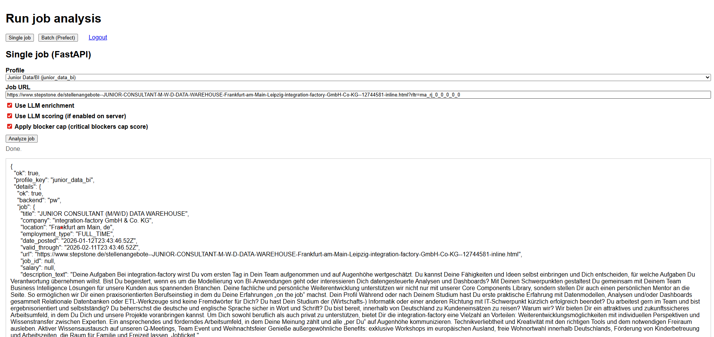
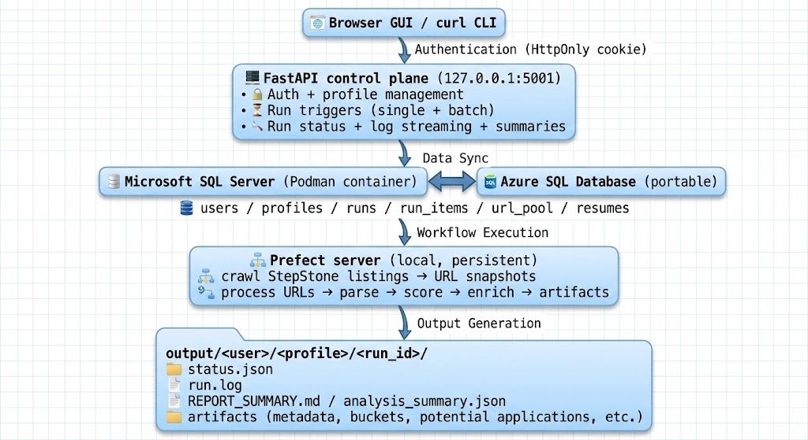
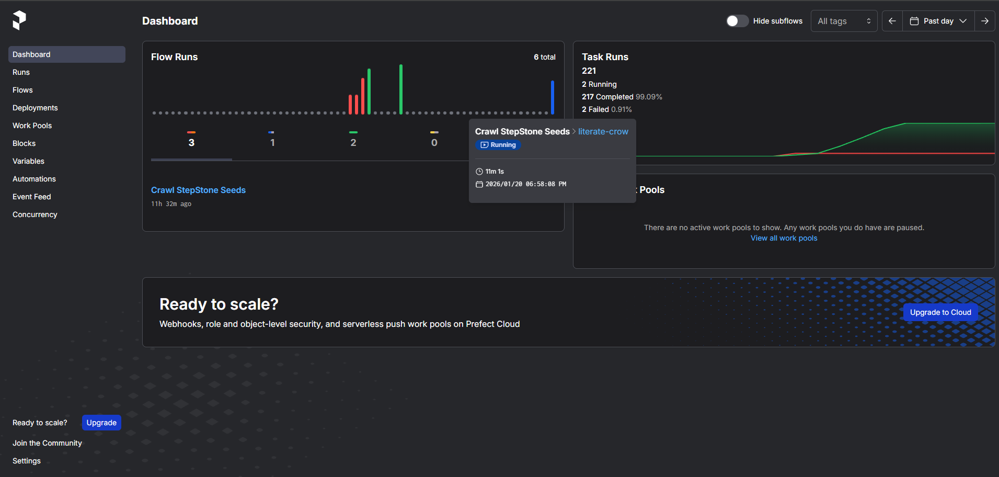
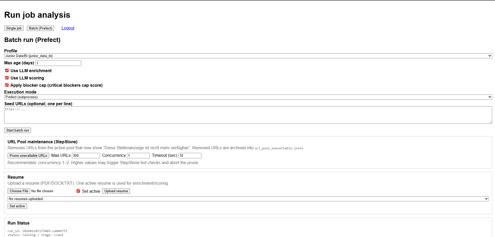
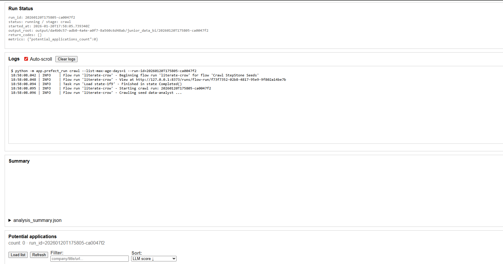
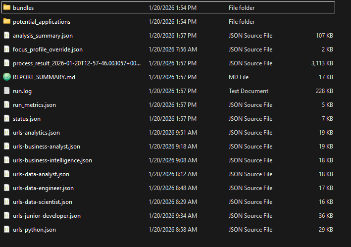
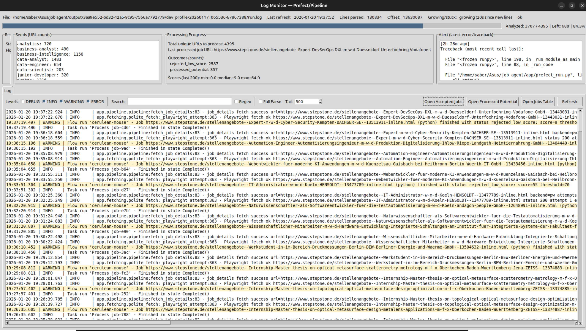
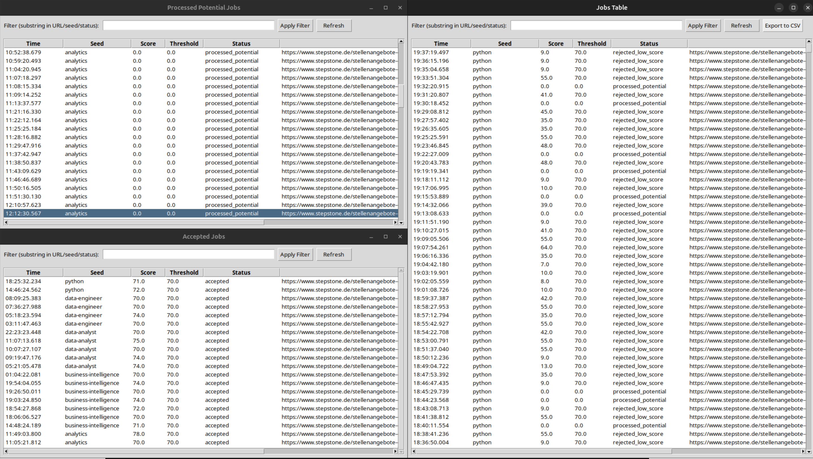

# Job Agent: Automation-First Job Triage for StepStone (Local-First, Observable, Explainable)

**Author:** Saber Sojudi Abdee Fard

## Table of Contents
- [Abstract](#abstract)
- [Keywords](#keywords)
- [Introduction](#introduction)
  - [What Job Agent produces](#what-job-agent-produces)
    - [Core outputs per analyzed job](#core-outputs-per-analyzed-job)
    - [Execution modes](#execution-modes)
  - [System at a glance](#system-at-a-glance)
- [Methodology](#methodology)
  - [Runtime architecture and service contracts](#runtime-architecture-and-service-contracts)
    - [Local-first runtime, cloud-ready persistence](#local-first-runtime-cloud-ready-persistence)
    - [Dependency discipline: keep services running, do not rebuild repeatedly](#dependency-discipline-keep-services-running-do-not-rebuild-repeatedly)
    - [FastAPI control plane responsibilities](#fastapi-control-plane-responsibilities)
    - [Prefect orchestration as an explicit dependency](#prefect-orchestration-as-an-explicit-dependency)
    - [Implementation anchors (where the runtime logic lives)](#implementation-anchors-where-the-runtime-logic-lives)
  - [Configuration as a contract](#configuration-as-a-contract)
    - [Fail-fast configuration behavior](#fail-fast-configuration-behavior)
    - [Portable DB configuration](#portable-db-configuration)
  - [Authentication and profile management](#authentication-and-profile-management)
    - [Auth model: HttpOnly cookie session + curl-friendly validation](#auth-model-httponly-cookie-session--curl-friendly-validation)
    - [Profile management: configuration is a first-class object](#profile-management-configuration-is-a-first-class-object)
    - [Upsert outcome signaling](#upsert-outcome-signaling)
    - [Implementation anchors (auth + profiles)](#implementation-anchors-auth--profiles)
  - [Run orchestration and observability](#run-orchestration-and-observability)
    - [The run model: run_id + run directory + durable status + append-only log](#the-run-model-run_id--run-directory--durable-status--append-only-log)
    - [Starting batch runs and tracking progress](#starting-batch-runs-and-tracking-progress)
    - [Schema-safety improvement: optional artifacts must not break status polling](#schema-safety-improvement-optional-artifacts-must-not-break-status-polling)
    - [Offset-based log streaming (efficient and UI-friendly)](#offset-based-log-streaming-efficient-and-ui-friendly)
    - [Implementation anchors (run lifecycle and monitoring)](#implementation-anchors-run-lifecycle-and-monitoring)
  - [Data model and migrations (SQLAlchemy + Alembic)](#data-model-and-migrations-sqlalchemy--alembic)
    - [Persistence goals](#persistence-goals)
    - [Alembic migrations as the schema evolution mechanism](#alembic-migrations-as-the-schema-evolution-mechanism)
    - [Implementation anchors (DB and migrations)](#implementation-anchors-db-and-migrations)
  - [Fetching strategy (HTTP + Playwright + “polite fetch”)](#fetching-strategy-http--playwright--polite-fetch)
    - [Fetching as a subsystem, not a single request](#fetching-as-a-subsystem-not-a-single-request)
    - [“Polite fetch” policy](#polite-fetch-policy)
    - [StepStone crawling](#stepstone-crawling)
    - [Implementation anchors (fetching and StepStone)](#implementation-anchors-fetching-and-stepstone)
  - [Pipeline internals (parse → enrich → score → output)](#pipeline-internals-parse--enrich--score--output)
    - [Parse and normalize first](#parse-and-normalize-first)
    - [Scoring design: explainable heuristics + optional LLM input](#scoring-design-explainable-heuristics--optional-llm-input)
    - [Output as the deliverable](#output-as-the-deliverable)
    - [Implementation anchors (pipeline)](#implementation-anchors-pipeline)
  - [URL pool deduplication and maintenance](#url-pool-deduplication-and-maintenance)
    - [Why dedup is mandatory](#why-dedup-is-mandatory)
    - [Safe pruning and rebuild](#safe-pruning-and-rebuild)
    - [Implementation anchors (URL pool)](#implementation-anchors-url-pool)
  - [Resume ingestion and contextual scoring](#resume-ingestion-and-contextual-scoring)
    - [Resume upload and reuse](#resume-upload-and-reuse)
    - [Dedup and parsing](#dedup-and-parsing)
    - [Implementation anchors (resume)](#implementation-anchors-resume)
- [Results](#results)
  - [End-to-end validation checkpoints (what I verified)](#end-to-end-validation-checkpoints-what-i-verified)
  - [What “success” looks like in practice](#what-success-looks-like-in-practice)
  - [Testing and regression strategy](#testing-and-regression-strategy)
    - [What the tests protect](#what-the-tests-protect)
    - [Implementation anchors (tests)](#implementation-anchors-tests)
  - [Discussion: Design trade-offs and why they are intentional](#discussion-design-trade-offs-and-why-they-are-intentional)
    - [Local-first vs “always cloud”](#local-first-vs-always-cloud)
    - [Orchestration dependency as a first-class concern](#orchestration-dependency-as-a-first-class-concern)
    - [Explainability vs “black box scoring”](#explainability-vs-black-box-scoring)
    - [Robustness vs aggressiveness in fetching](#robustness-vs-aggressiveness-in-fetching)
  - [Lessons learned (postmortem highlights)](#lessons-learned-postmortem-highlights)
  - [Roadmap (future work)](#roadmap-future-work)
    - [Integrate the Log Monitor project into Job Agent](#integrate-the-log-monitor-project-into-job-agent)
    - [Improve GUI and front end](#improve-gui-and-front-end)
    - [Reliability hardening and portability](#reliability-hardening-and-portability)
- [Conclusion](#conclusion)
- [References](#references)

## Abstract
Job searching often fails for a non-technical reason: attention runs out before the market does. The same loop repeats open a posting, scan requirements, estimate fit, and move on until the process becomes inconsistent and error-prone. **Job Agent** automates that triage loop for **StepStone** by converting job URLs into structured, decision-ready outputs: normalized job data, skill signals, language inference, explainable heuristic scoring, optional LLM-based enrichment/scoring, and explicit blockers. The system runs **locally** via a **FastAPI** control plane and persists state in **Microsoft SQL Server** (typically as a **SQL Server container using Podman**) with portability to **Azure SQL Database**. For scale and reliability, **Prefect** orchestrates batch execution with run-level observability (run_id, status, logs, summaries). To withstand job-board bot risk, Job Agent uses a “polite fetch” strategy with robots awareness, rate limiting, access-denied detection, and **Playwright** fallback for dynamic pages. The result is a practical automation system that reduces manual triage, preserves audit trails through run-scoped artifacts, and supports iterative refinement through authenticated profiles and resume-aware context.

Repository: https://github.com/sabers13/job-agent/tree/main

## Keywords
Automation, Python, FastAPI, SQLAlchemy, Alembic, SQL Server, Azure SQL Database, Prefect, Playwright, Web scraping resilience, Observability, LLM enrichment, Heuristic scoring, URL deduplication, Run artifacts

---

## Introduction
I built Job Agent to solve a repeatable problem I experienced while job searching: the limiting factor is rarely access to postings it is sustained attention and consistency. Manual triage is cognitively expensive, and it is easy to drift into unreliable decision-making when evaluating many similar job descriptions under time pressure.

Job Agent does not attempt to “apply automatically.” Instead, it focuses on automating the engineering work that can be standardized safely and repeated consistently: fetching job content reliably under real-world bot risk, extracting and normalizing that content into a stable schema, scoring fit using explainable heuristics (optionally complemented by LLM signals), and preserving results as run-scoped artifacts so every decision can be audited and iterated on.

---

### What Job Agent produces

#### Core outputs per analyzed job

* **Normalized job record**: stable representation of title/company/location/date/description.
* **Signals**: skill detection and language inference.
* **Scoring**:

  * explainable heuristic score (baseline)
  * optional LLM enrichment and/or LLM scoring
* **Decision safety**: blockers + cap rules so hard constraints are not masked by optimistic scoring.
* **Artifacts**: run-scoped outputs for review (reports + metadata + summaries) and bucketed triage.

#### Execution modes

* **Single job analysis**: fastest path to validate extraction → scoring → blockers → artifact output.
* **Batch runs**: orchestrated, observable runs that operate across listing seeds and URL pools.

*Figure 1    Single-job analysis in the GUI (FastAPI mode). I select a profile, paste a StepStone job URL, and run analysis with optional toggles (LLM enrichment, LLM scoring, blocker-cap). The response panel returns structured JSON (title, company, location, dates, canonical URL) plus extracted description text, demonstrating the core loop: URL → normalized record → scoring-ready output.*

---

### System at a glance

*Figure 2    Job Agent runtime architecture (local-first, portable persistence). The operator uses a browser GUI or curl CLI (HttpOnly cookie auth). A FastAPI control plane (127.0.0.1:5001) manages auth, profiles, and run triggers while exposing run status/log streaming/summaries. State persists in Microsoft SQL Server (Podman container) with portability to Azure SQL Database. Prefect executes crawl + processing workflows and writes run-scoped artifacts to output/<user>/<profile>/<run_id>/.*

---

## Methodology

### Runtime architecture and service contracts

#### Local-first runtime, cloud-ready persistence
I designed Job Agent as a local-first system to keep development and debugging deterministic. The API runs at:

- `http://127.0.0.1:5001`

State is stored in Microsoft SQL Server, most commonly via a **SQL Server container (Podman)** during development, with portability to **Azure SQL Database** through configuration. The goal is to avoid environment-specific code paths: the same ORM and migrations should run locally and in the cloud.

#### Dependency discipline: keep services running, do not rebuild repeatedly
An operational lesson that shaped the system is that stability depends more on service availability than on rebuilding environments. In practice, Job Agent works reliably when the dependencies are treated as long-running services: the SQL Server container must be running, the FastAPI app must be running, and the Prefect server must be running whenever batch orchestration is enabled. Adopting this operating model reduces false failures and makes issues diagnosable as dependency faults rather than “random batch instability.”

#### FastAPI control plane responsibilities
FastAPI acts as the operational boundary of the system. It provides an authenticated API surface for profile and resume management, exposes endpoints to trigger both single-job and batch runs, and includes health checks to report readiness of critical subsystems such as configuration, output paths, and database connectivity. It also owns run-level observability  status, log streaming, and summaries  so the system remains operable through HTTP even while batch processing is running or partially failing.

The design goal is to ensure the system remains operable through HTTP, even when batch processing is running or partially failing.

#### Prefect orchestration as an explicit dependency
Batch runs depend on a reachable Prefect API. I addressed instability caused by an unreachable Prefect endpoint by adopting a persistent Prefect server:

- `prefect server start --host 127.0.0.1 --port 8373`
- `PREFECT_API_URL=http://127.0.0.1:8373/api` (persisted in `.env.dev`)
- verified via: `curl http://127.0.0.1:8373/api/health`

This turns orchestration from an implicit assumption into an explicit, checkable dependency.

#### n8n as an alternative orchestration path
For teams already using **n8n**, there is a partial workflow prototype under `n8n workflows/`. It is not a full replacement for Prefect yet, but it can serve as a starting point if you prefer a visual workflow orchestrator for crawl/process runs.

*Figure 5    Prefect dashboard during a StepStone crawl (orchestrator-side visibility). Prefect shows flow runs and task runs (running/completed/failed counts), enabling quick verification that the Prefect API is reachable and that batch orchestration is progressing. This complements Job Agent’s own run logs and status endpoints.*

#### Implementation anchors (where the runtime logic lives)
- **FastAPI runtime + endpoints**: `app/fastapi_run.py`
- **Prefect entrypoints / orchestration**: `app/prefect_run.py`
- **Runtime configuration**: `app/config/settings.py`
- **GUI run directory + logs/status I/O**: `app/gui_runs/run_manager.py`

---

### Configuration as a contract

#### Fail-fast configuration behavior
I treat configuration validation as part of correctness because silent configuration drift is a common failure mode in automation pipelines. Job Agent defaults are designed to keep local execution reproducible  especially output paths and run directory structure  while feature toggles control runtime behavior such as whether Playwright is used by default and whether enrichment/scoring features are enabled. When LLM features are enabled, the API key requirement is enforced up front to fail fast and avoid ambiguous partial runs.

#### Portable DB configuration
Database connectivity is injected through environment variables so the same codebase can target both a local SQL Server container (Podman) and Azure SQL Database without environment-specific code paths. This keeps migrations and runtime connectivity aligned across environments and reduces the risk of divergence between development and deployment.

This keeps migration and runtime connectivity aligned across environments and reduces the chance of drift between dev and deployment.

### Authentication and profile management

#### Auth model: HttpOnly cookie session + curl-friendly validation
Job Agent uses JWT-based authentication delivered through an HttpOnly cookie. In the browser, cookie handling is automatic, while CLI workflows rely on a cookie jar (`jar.txt`) to persist and reuse an authenticated session. During validation, a 401 “Missing token” issue was resolved by consistently storing cookies at login (`-c jar.txt`) and sending them on subsequent requests (`-b jar.txt`). This confirmed the auth layer was functioning as intended and the failure was caused by inconsistent client-side session handling.

#### Profile management: configuration is a first-class object
Profiles represent job-search focus configuration (seeds, preferences, constraints, and scoring context). The API supports listing profiles via `GET /api/my/profiles` (plural) and idempotent profile creation/update via `POST /api/my/profile`. An earlier 405 error was traced to calling the singular upsert endpoint for listing; switching to the correct plural listing endpoint clarified the contract and removed ambiguity between “read” and “upsert” semantics.

#### Upsert outcome signaling
To make idempotent behavior explicit and testable, the upsert endpoint includes a response header indicating whether the request created a new profile or updated an existing one (`x-upsert-action: created|updated`). This small signal reduces ambiguity during rapid iteration and makes automated validation and debugging more straightforward.

This small affordance reduces ambiguity when iterating quickly across multiple profiles.

#### Implementation anchors (auth + profiles)
- **Auth routes**: `app/api/auth_routes.py`
- **Token and password security**: `app/auth/security.py`, `app/auth/constants.py`
- **Auth dependency resolution**: `app/auth/deps.py`
- **User CRUD**: `app/db/crud_users.py`
- **DB session management**: `app/db/session.py`
- **GUI pages (auth + profiles)**: `templates/gui_login.html`, `templates/gui_profiles.html`

---

### Run orchestration and observability

#### The run model: run_id + run directory + durable status + append-only log
Batch processing is organized around a simple run contract. Every execution is identified by a `run_id` and writes its outputs to a dedicated run-scoped directory. The run lifecycle is persisted as durable JSON status (so state can be recovered or inspected after restarts), and execution logs are written in an append-only form to support both incremental streaming during the run and reliable postmortems afterward. With this structure, batch work remains inspectable through HTTP and filesystem artifacts, without requiring direct access to Prefect’s internal state.

#### Starting batch runs and tracking progress
Batch runs are started with:

- `POST /api/start_batch_run` → returns `run_id`

From that point, the run is monitored through:

- `GET /api/run_status/{run_id}`
- `GET /api/run_logs/{run_id}?offset=&max_bytes=`
- `GET /api/run_summary/{run_id}`

#### Schema-safety improvement: optional artifacts must not break status polling
I fixed a Pydantic validation error caused by an optional artifact path being `None` when a string was expected. The fix was to make run status “safe by default” even when optional artifacts are absent (empty-object / optional fields).

This is a reliability rule for automation systems: observability endpoints must remain valid precisely when some outputs are missing.

#### Offset-based log streaming (efficient and UI-friendly)
Instead of returning the full log on every request, Job Agent streams logs incrementally using an offset protocol. The client supplies an `offset` and `max_bytes`, and the server responds with the next log chunk along with the updated offset to use for the subsequent call. This enables a tail-like experience in the GUI while keeping monitoring lightweight, bandwidth-efficient, and predictable even for long-running batch runs.

#### Implementation anchors (run lifecycle and monitoring)
- **Run directory, status, logs**: `app/gui_runs/run_manager.py`
  - `create_run_dir(...)`
  - `write_status(...)` / `load_status(...)`
  - `read_log_chunk(...)`
- **Run APIs + orchestration trigger**: `app/fastapi_run.py`
- **GUI run console**: `templates/gui_run.html`

*Figure 3    Batch run configuration (Prefect orchestration). The batch-run UI exposes operational controls: profile selection, max job age window, execution mode, and policy switches (LLM enrichment/scoring, blocker-cap). It also includes StepStone URL pool maintenance (prune unavailable postings) and resume upload/activation  keeping batch control, maintenance, and resume context in one operator surface.*

*Figure 4    Run status and incremental log streaming (run_id observability). The run panel displays run_id, current stage (e.g., crawl), output root, and lightweight metrics. The log viewer streams execution output incrementally with auto-scroll, showing the exact Prefect subcommand invoked and providing traceable progress without requiring shell access.*

### Data model and migrations (SQLAlchemy + Alembic)

#### Persistence goals
The database layer exists to make the system durable and auditable:

- profiles must persist and remain user-scoped
- run history must remain inspectable
- URL deduplication must survive across runs
- resumes must be versioned and reusable

#### Alembic migrations as the schema evolution mechanism
I manage schema evolution through Alembic. Migrations establish and evolve:

- users
- profiles
- runs
- run_items
- url_pool
- resumes

Profile metadata (name and description) was introduced to make profiles human-usable and GUI-friendly, not only key-based configuration.

#### Implementation anchors (DB and migrations)
- **Alembic config**: `alembic.ini`, `alembic/env.py`
- **Migration history**: `alembic/versions/*.py`
- **ORM models**: `app/db/models.py`

---

### Fetching strategy (HTTP + Playwright + “polite fetch”)
#### Fetching as a subsystem, not a single request
In a job-board pipeline, “fetch HTML” is not a trivial request  it is a reliability subsystem. Job sites impose practical constraints such as throttling and rate limits, access-denial pages that may still return HTTP 200, dynamic rendering with lazy-loaded content, and transient network or protocol failures. Job Agent addresses this by using a layered strategy: it can run HTTP-first or be Playwright-default (configurable), and it routes both approaches through a shared “polite fetch” policy to manage bot risk and keep behavior stable over time.

#### “Polite fetch” policy
The fetching layer is designed to behave predictably under load and under partial failure. It incorporates robots awareness, per-domain pacing/rate limiting, access-denial detection using both status codes and HTML content markers, and bounded retries with backoff. It also emits telemetry-rich logs so that failures are diagnosable and tuning decisions (timeouts, pacing, fallback behavior) can be made based on evidence rather than guesswork.

#### StepStone crawling
For StepStone, the system supports HTTP-based searching where it is sufficient, and Playwright-based searching when dynamic rendering or bot defenses require a browser context. It also includes date normalization logic to support freshness cutoffs (e.g., “only jobs newer than X days”), including German relative date formats, so the crawl remains both targeted and reproducible.

#### Implementation anchors (fetching and StepStone)
- **HTTP client**: `app/fetching/http_client.py`
- **Polite fetch logic**: `app/fetching/polite_fetch.py`
- **StepStone search**: `app/stepstone/search_http.py`, `app/stepstone/search_playwright.py`
- **Date normalization**: `app/stepstone/dates.py`

---

### Pipeline internals (parse → enrich → score → output)

#### Parse and normalize first
The pipeline converts raw job content into a stable schema before scoring. This reduces downstream brittleness and keeps scoring logic independent of source-specific quirks.
#### Scoring design: explainable heuristics + optional LLM input
I treat the heuristic score as the baseline because it is deterministic, explainable, and easy to validate over time. When configured, optional LLM enrichment/scoring adds interpretive value  especially for nuanced requirements or ambiguous wording  but hard constraints remain dominant. Blockers are made explicit, cap rules ensure that optimistic scoring cannot override non-starters, and a separate “potential applications” path captures borderline cases where the LLM signal suggests a second look without polluting the main acceptance bucket.

#### Output as the deliverable
The pipeline’s primary deliverable is a set of run-scoped artifacts rather than an ephemeral API response. Each run writes outputs that support both human review  through readable reports and summaries  and downstream automation  through structured metadata and bucketed outputs that can be filtered, compared across runs, and processed programmatically.

#### Implementation anchors (pipeline)
- `app/pipeline/pipeline.py`
- `app/pipeline/parsers.py`
- `app/pipeline/scoring.py`
- `app/pipeline/llm_enrich.py`
- `app/pipeline/output.py`
- `app/pipeline/potential_bucket.py`
- `app/pipeline/templating.py`

---

### URL pool deduplication and maintenance
#### Why dedup is mandatory
Batch runs must avoid reprocessing the same URLs; otherwise, time and compute are wasted and results become noisy. Job Agent maintains a per-profile URL pool in `jsonl` format so previously seen URLs can be skipped deterministically, dedup state persists across runs, and the pool remains easy to audit or inspect. Using `jsonl` also keeps the pool rebuildable from historical artifacts, which is valuable for recovery and long-term maintenance.

#### Safe pruning and rebuild
URL pool maintenance is designed to be conservative. It prunes clearly unavailable postings while avoiding destructive behavior when access-denied conditions are detected (to prevent accidental mass removal caused by bot defenses or transient blocks). The maintenance tooling also supports rebuilding/backfilling pools from historical snapshots, allowing the dedup state to be recovered or consolidated without relying on fragile manual steps.

#### Implementation anchors (URL pool)
- `app/pipeline/url_pool.py`
- `app/pipeline/url_pool_maintenance.py`
- `scripts/build_url_pool_from_snapshots.py`

---

### Resume ingestion and contextual scoring

#### Resume upload and reuse
Resume support is exposed through:

- `POST /api/my/resume` (multipart upload)
- `GET /api/my/resumes`

I encountered a resume upload failure caused by an incorrect local path (curl error 26), which reinforced a debugging discipline: separate client filesystem errors from API/server errors before investigating the backend.

#### Dedup and parsing
Resume storage is designed for:

- deduplication by content hash
- best-effort parsing into text/structured form
- reuse across runs to support resume-aware enrichment/scoring where configured

#### Implementation anchors (resume)
- resume endpoints in `app/fastapi_run.py`
- parsing: `app/pipeline/resume_parse.py`
- schema: `alembic/versions/*add_resumes_table*.py`

## Results

### End-to-end validation checkpoints (what I verified)
The system was validated using both browser and curl workflows:

- FastAPI is reachable locally; signup/signin works.
- Auth is stable when the cookie jar is reused consistently.
- Profiles can be listed via `GET /api/my/profiles` and saved via idempotent upsert.
- Single-job analysis works end-to-end:
  - extraction → skills detection → language inference → heuristic + optional LLM scoring → blockers → artifacts
- Batch orchestration runs reliably when Prefect is reachable and configured correctly.
- Database connectivity was verified independently (e.g., `SELECT DB_NAME()` returning `jobagent_dev` and `SELECT 1` returning `1`).

### What “success” looks like in practice
For a run to be useful, it must produce durable artifacts and an auditable trail:

- `run_id` identifies the execution
- `status.json` captures the lifecycle state
- `run.log` provides the operational trace
- summaries and structured JSON provide reviewable outputs

This definition of “works” is intentionally artifact-driven rather than “returned HTTP 200.”

*Figure 6    Run artifact directory (audit-first outputs). A completed run produces a structured output directory containing durable run metadata (status.json, run_metrics.json), a full execution trace (run.log), human-readable summaries (REPORT_SUMMARY.md), and machine-readable summaries (analysis_summary.json). The run also persists per-seed URL snapshots (urls-*.json) plus folders for bundles and potential applications  making results reproducible, inspectable, and easy to compare across iterations.*

---

### Testing and regression strategy

#### What the tests protect
Automation pipelines tend to break at the seams  where configuration, caching, scoring policy, artifact writing, and API contracts interact. My test suite is designed to protect those seams by validating default configuration behavior, cache/state correctness, scoring invariants (including cap and blocker rules), and artifact generation/bundle integrity. It also guards API contract stability  especially run monitoring behavior such as offset-based log streaming  so the GUI and CLI workflows remain reliable as the code evolves. To keep the suite deterministic and fast, the tests avoid live job-board calls by relying on fixtures and mocking where appropriate.

#### Implementation anchors (tests)
- `tests/test_api_endpoints.py`
- `tests/test_pipeline_end_to_end.py`
- `tests/test_fetch_details_e2e.py`
- `tests/test_llm_scoring_mocked.py`
- `tests/test_scoring.py`, `tests/test_score.py`
- `tests/test_state_cache.py`, `tests/test_cache_version_ttl.py`
- `tests/test_smoke.py`, `tests/test_smoke_backend.py`

---

### Discussion: Design trade-offs and why they are intentional

#### Local-first vs “always cloud”
I chose local-first execution to maximize iteration speed and debugging clarity. Portability to Azure SQL Database is handled through configuration, not separate code paths.

#### Orchestration dependency as a first-class concern
Prefect is an explicit dependency. Batch reliability requires a reachable Prefect API, so I adopted a persistent Prefect server and made health verification part of the operating model.

#### Explainability vs “black box scoring”
Heuristic scoring provides determinism and auditability. Optional LLM enrichment adds interpretive value, but blockers and cap rules ensure hard constraints remain dominant.

#### Robustness vs aggressiveness in fetching
A resilient fetch layer is slower than a naive scraper, but it is stable under bot risk. Rate limiting, robots awareness, and denial detection prevent destructive behavior and improve long-run reliability.

---

### Lessons learned (postmortem highlights)

- **Run what you need; do not rebuild everything**: reliability comes from keeping DB/app/Prefect available.
- **Most auth bugs are client session state**: cookie jar discipline eliminated “Missing token” 401s.
- **Endpoint semantics matter**: listing is plural (`/api/my/profiles`); upsert is singular (`/api/my/profile`).
- **Observability must not fail**: optional artifacts must never break run status polling.
- **Prefect stability depends on API reachability**: persistent Prefect server + pinned `PREFECT_API_URL` eliminated batch failures.
- **Health endpoints must be correct**: a buggy health route can create false diagnoses even when the DB is fine.
- **Artifacts are the real deliverable**: the most meaningful validation is that run outputs and summaries exist and are consistent.

---

### Roadmap (future work)

#### Integrate the Log Monitor project into Job Agent
I also built a separate log monitoring project that tails logs and presents structured summaries (progress, outcome tables, latest errors). The clean integration path is to align it with Job Agent’s run model:

1. Add a run dashboard endpoint that derives structured state from `run.log`.
2. Add a GUI “Run Dashboard” view:
   - accepted jobs in a dedicated tab
   - potential applications tab
   - rejected jobs table with score/reason
   - progress bar: analyzed vs remaining
   - latest error panel
3. Persist a `run_dashboard.json` artifact for postmortems and historical review.

#### Improve GUI and front end
- More readable, sortable tables (link/seed/score/status).
- Log viewer improvements (newest-first option, search, highlight errors).
- Progress visualization tied to run metrics (processed vs remaining).
- Better navigation across historical runs and artifacts.

#### Reliability hardening and portability
- Ensure `/health/db` accurately reflects DB readiness and cannot fail due to internal naming bugs.
- Standardize dependency reporting and startup checks (DB, Prefect API, output directory).
- Keep migrations Azure SQL–safe as the schema evolves.

*Figure 7    A monitoring view summarizes run state: seed counts, total unique URLs, accepted/rejected breakdown, and a “latest error” panel. Below, an incremental log tailer updates in real time. A structured jobs table lists link/seed/score/status to enable rapid triage and review.*

*Figure 8    A sortable table view highlights accepted, potential, and rejected outcomes for quick scanning. In the background, the monitoring view remains available for progress and error visibility. Together, they represent the intended operator workflow: run → monitor → inspect outcomes → iterate.*

---

## Conclusion
Job Agent is an automation-first triage system for StepStone built for reproducibility and operational clarity: a FastAPI control plane, SQL Server persistence (Podman container) with portability to Azure SQL Database, Prefect-orchestrated batch runs, and a resilient fetch subsystem with Playwright fallback. The pipeline outputs explainable, auditable artifacts scores, blockers, summaries, and bucketed results so triage becomes consistent and improvable over time.

From a portfolio and resume perspective, the project demonstrates full-stack backend engineering: API design and auth, relational modeling and migrations, orchestration and observability, resilient web automation, explainable scoring policy design, and a regression strategy that protects the system’s operational contracts.

---

## References

[1] S. Ramírez (tiangolo) and FastAPI contributors, “FastAPI Documentation,” *FastAPI Project* (official documentation). Accessed: Jan. 21, 2026. ([fastapi.tiangolo.com][1])

[2] SQLAlchemy authors and contributors, “SQLAlchemy 2.0 Documentation,” *SQLAlchemy Project* (official documentation). Accessed: Jan. 21, 2026. ([docs.sqlalchemy.org][2])

[3] Alembic authors and contributors, “Alembic Documentation,” *Alembic / SQLAlchemy Project* (official documentation). Accessed: Jan. 21, 2026. ([alembic.sqlalchemy.org][3])

[4] Microsoft, “SQL Server technical documentation,” *Microsoft Learn*. Accessed: Jan. 21, 2026. ([Microsoft Learn][4])

[5] Microsoft, “Azure SQL Database documentation,” *Microsoft Learn*. Accessed: Jan. 21, 2026. ([Microsoft Learn][5])

[6] Prefect Technologies, “Prefect Documentation,” *Prefect* (official documentation). Accessed: Jan. 21, 2026. ([Prefect][6])

[7] Microsoft, “Playwright for Python Documentation,” *Playwright* (official documentation). Accessed: Jan. 21, 2026. ([playwright.dev][7])

[8] Saber Sojudi Abdee Fard, “Job Agent Repository,” *GitHub*. Accessed: Jan. 21, 2026. ([Job Agent Repo][8])

[1]: https://fastapi.tiangolo.com/?utm_source=chatgpt.com "FastAPI"
[2]: https://docs.sqlalchemy.org/?utm_source=chatgpt.com "SQLAlchemy Documentation — SQLAlchemy 2.0 ..."
[3]: https://alembic.sqlalchemy.org/?utm_source=chatgpt.com "Welcome to Alembic's documentation! — Alembic 1.18.1 ..."
[4]: https://learn.microsoft.com/en-us/sql/sql-server/?view=sql-server-ver17&utm_source=chatgpt.com "SQL Server Technical Documentation"
[5]: https://learn.microsoft.com/en-us/azure/azure-sql/database/?view=azuresql&utm_source=chatgpt.com "Azure SQL Database documentation"
[6]: https://docs.prefect.io/?utm_source=chatgpt.com "Prefect documentation"
[7]: https://playwright.dev/python/docs/library?utm_source=chatgpt.com "Getting started - Library | Playwright Python"
[8]: https://github.com/sabers13/job-agent/tree/main "Job Agent repository"
